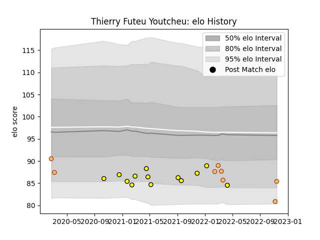

---  
layout: page  
title: Thierry Futeu Youtcheu  
date: 2022-11-15 23:43:54.320702  
categories: player  
---
# Thierry Futeu Youtcheu

## Positions: P

## Country: Spain

## Current elo: 85.0

## Current Percentile: 5.0

# Elo History

# Match History

| Team        |   Appearances |   Win Rate |
|:------------|--------------:|-----------:|
| Carcassonne |            13 |   0.153846 |
| Spain       |             8 |   0.625    |

| Opponent           |   Matches |   Win Rate |
|:-------------------|----------:|-----------:|
| Oyonnax            |         2 |        0   |
| Beziers            |         2 |        0.5 |
| Romania            |         2 |        0.5 |
| Mont-de-Marsan     |         2 |        0   |
| Bayonne            |         1 |        0   |
| Russia             |         1 |        1   |
| Provence Rugby     |         1 |        1   |
| Portugal           |         1 |        1   |
| Perpignan          |         1 |        0   |
| Namibia            |         1 |        1   |
| Nevers             |         1 |        0   |
| Belgium            |         1 |        1   |
| Montauban          |         1 |        0   |
| Grenoble           |         1 |        0   |
| Georgia            |         1 |        0   |
| Biarritz Olympique |         1 |        0   |
| Tonga              |         1 |        0   |