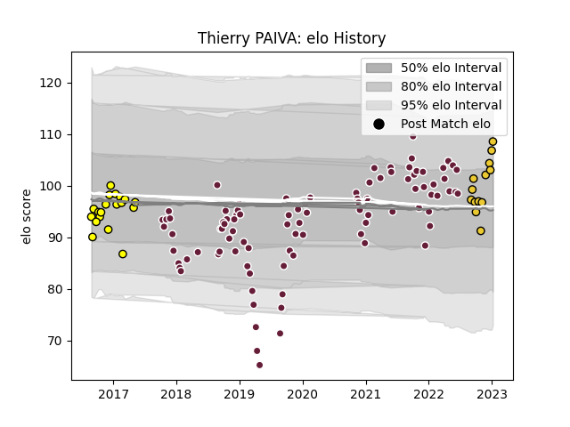

---  
layout: page  
title: Thierry PAIVA  
date: 2023-01-06 11:51:29.086987  
categories: player  
---
# Thierry PAIVA

## Positions: P

## Current elo: 107.0

## Current Percentile: 71.0

# Elo History

# Match History

| Team            |   Appearances |   Win Rate |
|:----------------|--------------:|-----------:|
| Bordeaux Begles |            93 |   0.569892 |
| Carcassonne     |            19 |   0.5      |
| La Rochelle     |            12 |   0.75     |

| Opponent             |   Matches |   Win Rate |
|:---------------------|----------:|-----------:|
| Montpellier Herault  |         9 |   0.666667 |
| Toulon               |         8 |   0.5      |
| Stade Toulousain     |         8 |   0.25     |
| Racing 92            |         8 |   0.625    |
| Agen                 |         7 |   0.714286 |
| Perpignan            |         7 |   0.785714 |
| Brive                |         7 |   0.5      |
| Castres Olympique    |         6 |   0.833333 |
| Stade Francais Paris |         6 |   0.666667 |
| Lyon                 |         6 |   0.833333 |
| Clermont Auvergne    |         5 |   0.5      |
| La Rochelle          |         4 |   0.25     |
| Pau                  |         4 |   0.5      |
| Biarritz Olympique   |         4 |   0.5      |
| Dragons              |         2 |   0.5      |
| Aurillac             |         2 |   0.5      |
| Grenoble             |         2 |   0.5      |
| RC Enisei            |         2 |   1        |
| Albi                 |         2 |   0.25     |
| Beziers              |         2 |   0.5      |
| Soyaux-Angouleme     |         2 |   0.5      |
| Newcastle Falcons    |         2 |   0        |
| Sale Sharks          |         2 |   0.5      |
| Vannes               |         2 |   1        |
| Bayonne              |         2 |   1        |
| Ulster               |         1 |   1        |
| Scarlets             |         1 |   1        |
| Oyonnax              |         1 |   0        |
| Bordeaux Begles      |         1 |   0        |
| Colomiers            |         1 |   0        |
| Narbonne             |         1 |   0        |
| Bourgoin-Jallieu     |         1 |   1        |
| Mont-de-Marsan       |         1 |   1        |
| Leicester Tigers     |         1 |   0        |
| Edinburgh            |         1 |   0.5      |
| Dax                  |         1 |   1        |
| Connacht             |         1 |   0        |
| Wasps                |         1 |   1        |