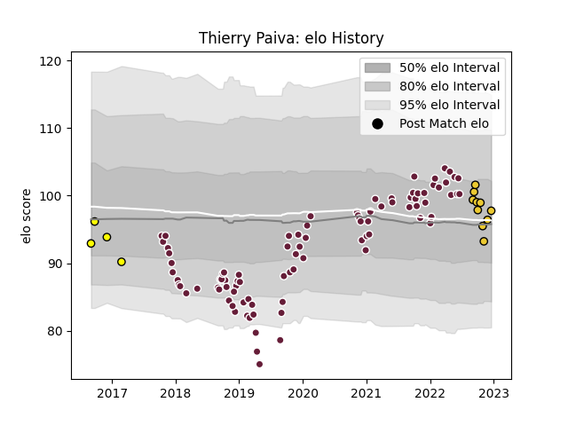

---  
layout: page  
title: Thierry Paiva  
date: 2022-12-18 16:26:06.825810  
categories: player  
---
# Thierry Paiva

## Positions: P

## Current elo: 98.0

## Current Percentile: 52.0

# Elo History

# Match History

| Team            |   Appearances |   Win Rate |
|:----------------|--------------:|-----------:|
| Bordeaux Begles |            89 |   0.578652 |
| La Rochelle     |            10 |   0.8      |
| Carcassonne     |             4 |   0        |

| Opponent             |   Matches |   Win Rate |
|:---------------------|----------:|-----------:|
| Montpellier Herault  |         8 |   0.6875   |
| Racing 92            |         8 |   0.625    |
| Toulon               |         8 |   0.5      |
| Stade Toulousain     |         7 |   0.285714 |
| Agen                 |         7 |   0.714286 |
| Brive                |         7 |   0.5      |
| Castres Olympique    |         6 |   0.833333 |
| Stade Francais Paris |         6 |   0.666667 |
| Perpignan            |         6 |   0.75     |
| Lyon                 |         6 |   0.833333 |
| Clermont Auvergne    |         5 |   0.5      |
| La Rochelle          |         4 |   0.25     |
| Pau                  |         3 |   0.333333 |
| Biarritz Olympique   |         2 |   0.5      |
| Grenoble             |         2 |   0.5      |
| Dragons              |         2 |   0.5      |
| Newcastle Falcons    |         2 |   0        |
| Bayonne              |         2 |   1        |
| RC Enisei            |         2 |   1        |
| Sale Sharks          |         2 |   0.5      |
| Scarlets             |         1 |   1        |
| Ulster               |         1 |   1        |
| Oyonnax              |         1 |   0        |
| Aurillac             |         1 |   0        |
| Edinburgh            |         1 |   0.5      |
| Connacht             |         1 |   0        |
| Colomiers            |         1 |   0        |
| Wasps                |         1 |   1        |