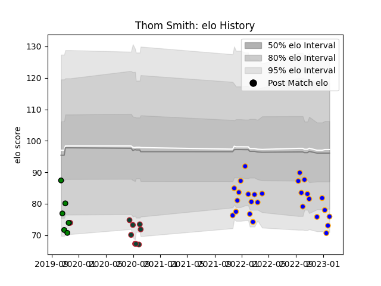

---  
layout: page  
title: Thom Smith  
date: 2023-01-13 11:26:41.978712  
categories: player  
---
# Thom Smith

## Positions: N8, FL

## Current elo: 78.0

## Current Percentile: 14.0

# Elo History

# Match History

| Team               |   Appearances |   Win Rate |
|:-------------------|--------------:|-----------:|
| Doncaster          |            24 |   0.75     |
| Leicester Tigers   |             9 |   0.222222 |
| Yorkshire Carnegie |             6 |   0        |

| Opponent            |   Matches |   Win Rate |
|:--------------------|----------:|-----------:|
| Hartpury College    |         4 |   0.75     |
| Ealing Trailfinders |         4 |   0.5      |
| Ampthill            |         3 |   0.666667 |
| Bedford             |         3 |   0.666667 |
| Nottingham          |         3 |   0.666667 |
| Cornish Pirates     |         3 |   0.333333 |
| Coventry            |         3 |   0.333333 |
| Richmond            |         2 |   1        |
| London Scottish     |         2 |   0.5      |
| Jersey              |         2 |   0.5      |
| Toulon              |         1 |   0        |
| Northampton Saints  |         1 |   1        |
| Gloucester Rugby    |         1 |   0        |
| Harlequins          |         1 |   0        |
| Bath Rugby          |         1 |   0        |
| Exeter Chiefs       |         1 |   0        |
| Cardiff Blues       |         1 |   1        |
| Caldy               |         1 |   1        |
| Bristol Rugby       |         1 |   0        |
| Wasps               |         1 |   0        |