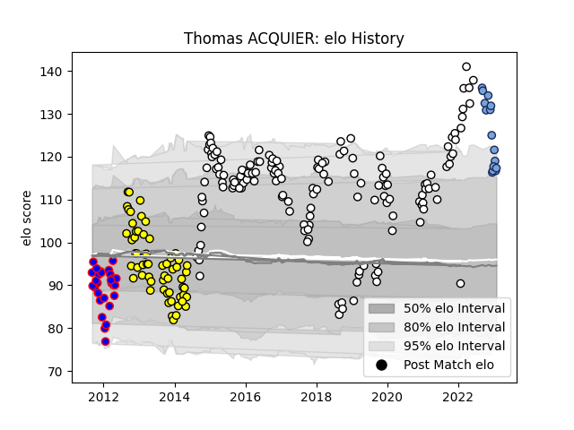

---  
layout: page  
title: Thomas ACQUIER  
date: 2023-02-05 17:56:49.734341  
categories: player  
---
# Thomas ACQUIER

## Positions: H

## Current elo: 101.0

## Current Percentile: 74.0

# Elo History

# Match History

| Team        |   Appearances |   Win Rate |
|:------------|--------------:|-----------:|
| Brive       |           147 |   0.530612 |
| Carcassonne |            59 |   0.432203 |
| Beziers     |            28 |   0.285714 |
| Bayonne     |            16 |   0.34375  |

| Opponent               |   Matches |   Win Rate |
|:-----------------------|----------:|-----------:|
| La Rochelle            |        16 |   0.25     |
| Pau                    |        12 |   0.416667 |
| Oyonnax                |        12 |   0.583333 |
| Lyon                   |        12 |   0.5      |
| Castres Olympique      |        11 |   0.363636 |
| Toulon                 |        10 |   0.6      |
| Stade Francais Paris   |         9 |   0.666667 |
| Racing 92              |         9 |   0.555556 |
| Montpellier Herault    |         9 |   0.388889 |
| Stade Toulousain       |         8 |   0.25     |
| Bayonne                |         8 |   0.4375   |
| Bordeaux Begles        |         8 |   0.4375   |
| Grenoble               |         7 |   0.571429 |
| Agen                   |         7 |   0.428571 |
| Aurillac               |         7 |   0.285714 |
| Colomiers              |         6 |   0.5      |
| Dax                    |         6 |   0.5      |
| Beziers                |         6 |   0.833333 |
| Auch                   |         6 |   0.5      |
| Tarbes                 |         6 |   0.333333 |
| Albi                   |         6 |   0.5      |
| Narbonne               |         6 |   0.166667 |
| Clermont Auvergne      |         5 |   0.6      |
| Bourgoin-Jallieu       |         4 |   0.5      |
| Worcester Warriors     |         4 |   0.75     |
| Brive                  |         4 |   0.75     |
| Mont-de-Marsan         |         4 |   0.5      |
| Biarritz Olympique     |         3 |   0.833333 |
| Provence Rugby         |         3 |   0.666667 |
| Massy                  |         3 |   0.333333 |
| RC Enisei              |         3 |   0.666667 |
| US Bressane            |         3 |   0.333333 |
| Scarlets               |         2 |   0        |
| Vannes                 |         2 |   1        |
| Benetton Treviso       |         2 |   0        |
| Carcassonne            |         2 |   0        |
| Newcastle Falcons      |         2 |   0.5      |
| Périgueux              |         2 |   0.5      |
| Perpignan              |         2 |   0.5      |
| Gloucester Rugby       |         2 |   0        |
| Connacht               |         2 |   0.5      |
| Zebre                  |         2 |   0.5      |
| Nevers                 |         1 |   1        |
| Soyaux-Angouleme       |         1 |   1        |
| Bath Rugby             |         1 |   0        |
| Bristol Rugby          |         1 |   0        |
| Enisey-STM Krasnoyarsk |         1 |   1        |
| Edinburgh              |         1 |   0        |
| Dragons                |         1 |   1        |