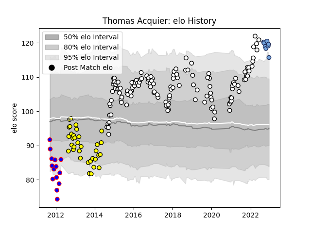

---  
layout: page  
title: Thomas Acquier  
date: 2022-12-14 11:30:57.731235  
categories: player  
---
# Thomas Acquier

## Positions: H

## Current elo: 116.0

## Current Percentile: 96.0

# Elo History

# Match History

| Team        |   Appearances |   Win Rate |
|:------------|--------------:|-----------:|
| Brive       |           130 |   0.507692 |
| Carcassonne |            34 |   0.397059 |
| Beziers     |            14 |   0.285714 |
| Bayonne     |             8 |   0.375    |

| Opponent             |   Matches |   Win Rate |
|:---------------------|----------:|-----------:|
| La Rochelle          |        12 |   0.25     |
| Castres Olympique    |        11 |   0.363636 |
| Oyonnax              |        10 |   0.7      |
| Stade Francais Paris |         9 |   0.666667 |
| Racing 92            |         9 |   0.555556 |
| Pau                  |         9 |   0.5      |
| Montpellier Herault  |         9 |   0.388889 |
| Lyon                 |         9 |   0.444444 |
| Toulon               |         8 |   0.5      |
| Stade Toulousain     |         7 |   0.285714 |
| Bordeaux Begles      |         7 |   0.5      |
| Agen                 |         5 |   0.6      |
| Beziers              |         5 |   0.8      |
| Bayonne              |         5 |   0.5      |
| Auch                 |         5 |   0.4      |
| Clermont Auvergne    |         4 |   0.5      |
| Colomiers            |         4 |   0.25     |
| Worcester Warriors   |         4 |   0.75     |
| Grenoble             |         4 |   0.75     |
| Narbonne             |         4 |   0        |
| Aurillac             |         4 |   0        |
| Biarritz Olympique   |         3 |   0.833333 |
| Brive                |         3 |   0.666667 |
| RC Enisei            |         3 |   0.666667 |
| Albi                 |         3 |   0.666667 |
| Tarbes               |         3 |   0.333333 |
| US Bressane          |         3 |   0.333333 |
| Dax                  |         3 |   0.333333 |
| Perpignan            |         2 |   0.5      |
| Newcastle Falcons    |         2 |   0.5      |
| Zebre                |         2 |   0.5      |
| Mont-de-Marsan       |         2 |   0.5      |
| Massy                |         2 |   0.5      |
| Gloucester Rugby     |         2 |   0        |
| Connacht             |         2 |   0.5      |
| Provence Rugby       |         1 |   0        |
| Bourgoin-Jallieu     |         1 |   1        |
| Scarlets             |         1 |   0        |
| Bath Rugby           |         1 |   0        |
| Bristol Rugby        |         1 |   0        |
| Dragons              |         1 |   1        |
| Carcassonne          |         1 |   0        |