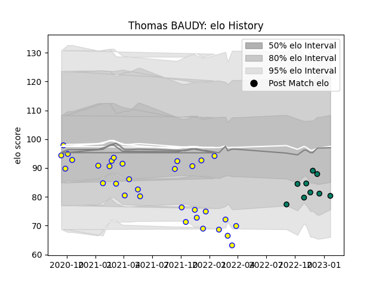

---  
layout: page  
title: Thomas BAUDY  
date: 2023-02-02 19:11:33.513141  
categories: player  
---
# Thomas BAUDY

## Positions: FB, W

## Current elo: 77.0

## Current Percentile: 15.0

# Elo History

# Match History

| Team     |   Appearances |   Win Rate |
|:---------|--------------:|-----------:|
| Aubenas  |            32 |   0.296875 |
| Suresnes |            10 |   0.5      |

| Opponent                   |   Matches |   Win Rate |
|:---------------------------|----------:|-----------:|
| Blagnac                    |         5 |   0.2      |
| Chambery                   |         5 |   0.6      |
| Nice                       |         5 |   0        |
| Suresnes                   |         4 |   0.5      |
| Albi                       |         3 |   0        |
| Narbonne                   |         3 |   0.333333 |
| Valence Romans Drome Rugby |         3 |   0        |
| Cognac Saint Jean d'Angély |         2 |   0.5      |
| Dijon                      |         2 |   0.25     |
| Rennes                     |         2 |   1        |
| Tarbes                     |         2 |   1        |
| US Bressane                |         2 |   0        |
| Bourgoin-Jallieu           |         1 |   1        |
| Dax                        |         1 |   1        |
| Massy                      |         1 |   0        |
| Soyaux-Angouleme           |         1 |   0        |