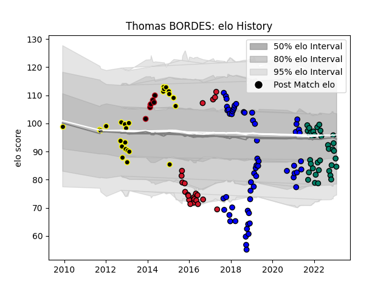

---  
layout: page  
title: Thomas BORDES  
date: 2023-02-06 16:03:03.496108  
categories: player  
---
# Thomas BORDES

## Positions: H

## Current elo: 85.0

## Current Percentile: 24.0

# Elo History

# Match History

| Team           |   Appearances |   Win Rate |
|:---------------|--------------:|-----------:|
| Massy          |            59 |   0.322034 |
| Suresnes       |            35 |   0.428571 |
| Mont-de-Marsan |            25 |   0.28     |
| Oyonnax        |            22 |   0.318182 |
| Lyon           |             7 |   1        |

| Opponent                   |   Matches |   Win Rate |
|:---------------------------|----------:|-----------:|
| Bourgoin-Jallieu           |         8 |   0.625    |
| Dax                        |         7 |   0.571429 |
| Mont-de-Marsan             |         6 |   0.5      |
| Beziers                    |         6 |   0.333333 |
| Soyaux-Angouleme           |         6 |   0.25     |
| US Bressane                |         5 |   0.4      |
| Narbonne                   |         5 |   0.4      |
| Blagnac                    |         5 |   0.4      |
| Montauban                  |         5 |   0        |
| Grenoble                   |         5 |   0.2      |
| Tarbes                     |         5 |   0.8      |
| Nice                       |         5 |   0.2      |
| Agen                       |         4 |   0.25     |
| Bayonne                    |         4 |   0        |
| Nevers                     |         3 |   0.333333 |
| Perpignan                  |         3 |   0        |
| Massy                      |         3 |   0        |
| Albi                       |         3 |   0.333333 |
| Oyonnax                    |         3 |   0        |
| Vannes                     |         3 |   0.333333 |
| Bordeaux Begles            |         3 |   1        |
| Colomiers                  |         3 |   0.666667 |
| Cognac Saint Jean d'Angély |         3 |   1        |
| Clermont Auvergne          |         3 |   0        |
| Chambery                   |         3 |   0.5      |
| Aurillac                   |         3 |   0.333333 |
| Biarritz Olympique         |         3 |   0.666667 |
| Carcassonne                |         3 |   0.666667 |
| Provence Rugby             |         2 |   0.5      |
| Valence Romans Drome Rugby |         2 |   0        |
| Aubenas                    |         2 |   0.5      |
| Saracens                   |         2 |   0        |
| Rennes                     |         2 |   1        |
| Gloucester Rugby           |         2 |   0        |
| Dijon                      |         2 |   1        |
| Pau                        |         2 |   0        |
| Brive                      |         2 |   0.5      |
| Castres Olympique          |         2 |   0        |
| La Rochelle                |         2 |   1        |
| London Irish               |         2 |   0        |
| Racing 92                  |         1 |   0        |
| Carqueiranne-Hyères        |         1 |   0        |
| Stade Francais Paris       |         1 |   0        |
| Toulon                     |         1 |   0        |
| Montpellier Herault        |         1 |   0        |
| Ulster                     |         1 |   0        |