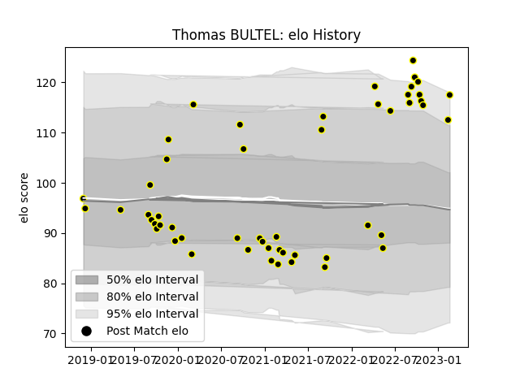

---  
layout: page  
title: Thomas BULTEL  
date: 2023-03-11 00:13:27.405952  
categories: player  
---
# Thomas BULTEL

## Positions: P

## Current elo: 123.0

## Current Percentile: 95.0

# Elo History

# Match History

| Team           |   Appearances |   Win Rate |
|:---------------|--------------:|-----------:|
| Mont-de-Marsan |            54 |   0.481481 |

| Opponent                   |   Matches |   Win Rate |
|:---------------------------|----------:|-----------:|
| Vannes                     |         6 |   0.333333 |
| Beziers                    |         6 |   0.666667 |
| Carcassonne                |         4 |   0.75     |
| Perpignan                  |         4 |   0        |
| Oyonnax                    |         3 |   0.333333 |
| Biarritz Olympique         |         3 |   0.5      |
| US Bressane                |         3 |   0.666667 |
| Aurillac                   |         3 |   1        |
| Nevers                     |         3 |   0        |
| Valence Romans Drome Rugby |         2 |   0.75     |
| Rouen                      |         2 |   0.5      |
| Provence Rugby             |         2 |   0.5      |
| Agen                       |         2 |   0        |
| Montauban                  |         2 |   0.5      |
| Grenoble                   |         2 |   1        |
| Colomiers                  |         2 |   0        |
| Massy                      |         1 |   0        |
| Roval Drome XV             |         1 |   0        |
| Soyaux-Angouleme           |         1 |   1        |
| Brive                      |         1 |   1        |
| Narbonne                   |         1 |   1        |