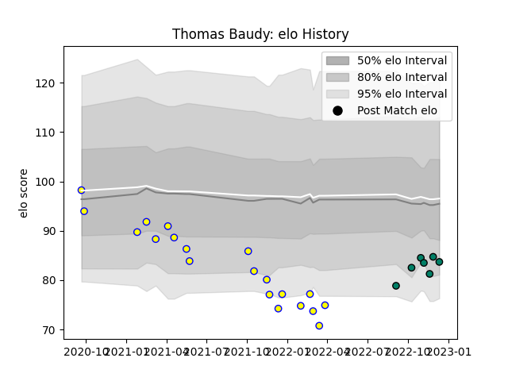

---  
layout: page  
title: Thomas Baudy  
date: 2022-12-18 16:33:51.505873  
categories: player  
---
# Thomas Baudy

## Positions: FB, W

## Current elo: 84.0

## Current Percentile: 14.0

# Elo History

# Match History

| Team     |   Appearances |   Win Rate |
|:---------|--------------:|-----------:|
| Aubenas  |            20 |   0.15     |
| Suresnes |             7 |   0.571429 |

| Opponent                   |   Matches |   Win Rate |
|:---------------------------|----------:|-----------:|
| Suresnes                   |         4 |        0.5 |
| Blagnac                    |         3 |        0   |
| Valence Romans Drome Rugby |         3 |        0   |
| Albi                       |         2 |        0   |
| Chambery                   |         2 |        0.5 |
| Nice                       |         2 |        0   |
| US Bressane                |         2 |        0   |
| Bourgoin-Jallieu           |         1 |        1   |
| Cognac Saint Jean d'Angély |         1 |        0   |
| Dax                        |         1 |        1   |
| Dijon                      |         1 |        0   |
| Massy                      |         1 |        0   |
| Narbonne                   |         1 |        0   |
| Rennes                     |         1 |        1   |
| Soyaux-Angouleme           |         1 |        0   |
| Tarbes                     |         1 |        1   |