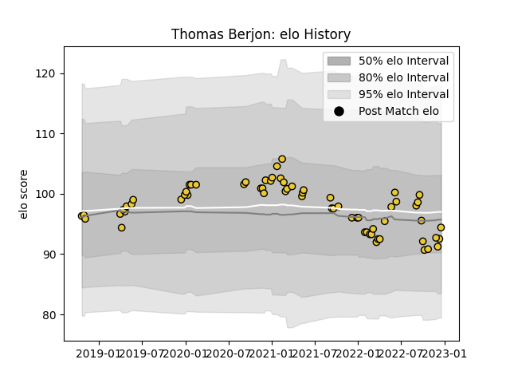

---  
layout: page  
title: Thomas Berjon  
date: 2023-02-02 19:03:32.602730  
categories: player  
---
# Thomas Berjon

## Positions: SH

## Current elo: 96.0

## Current Percentile: 56.0

# Elo History

# Match History

| Team        |   Appearances |   Win Rate |
|:------------|--------------:|-----------:|
| La Rochelle |            73 |   0.616438 |

| Opponent             |   Matches |   Win Rate |
|:---------------------|----------:|-----------:|
| Stade Toulousain     |         7 |   0.285714 |
| Stade Francais Paris |         6 |   0.333333 |
| Racing 92            |         6 |   0.5      |
| Montpellier Herault  |         5 |   0.6      |
| Lyon                 |         5 |   0.6      |
| Castres Olympique    |         5 |   0.4      |
| Toulon               |         4 |   0.75     |
| Perpignan            |         4 |   1        |
| Agen                 |         4 |   1        |
| Clermont Auvergne    |         4 |   0.25     |
| Bordeaux Begles      |         4 |   0.75     |
| Pau                  |         3 |   1        |
| Brive                |         3 |   0.666667 |
| Bayonne              |         2 |   0.5      |
| Northampton Saints   |         2 |   1        |
| Sale Sharks          |         2 |   1        |
| Ulster               |         2 |   1        |
| Glasgow Warriors     |         1 |   1        |
| Exeter Chiefs        |         1 |   0        |
| RC Enisei            |         1 |   1        |
| Bristol Rugby        |         1 |   1        |
| Biarritz Olympique   |         1 |   0        |