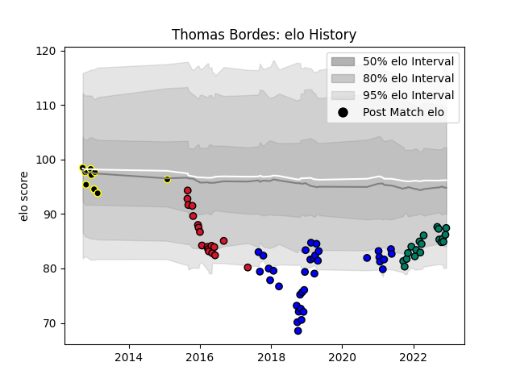

---  
layout: page  
title: Thomas Bordes  
date: 2022-12-09 13:22:06.767099  
categories: player  
---
# Thomas Bordes

## Positions: H

## Current elo: 87.0

## Current Percentile: 13.0

# Elo History

# Match History

| Team           |   Appearances |   Win Rate |
|:---------------|--------------:|-----------:|
| Massy          |            35 |   0.314286 |
| Suresnes       |            19 |   0.315789 |
| Oyonnax        |            18 |   0.166667 |
| Mont-de-Marsan |             9 |   0.222222 |

| Opponent                   |   Matches |   Win Rate |
|:---------------------------|----------:|-----------:|
| Montauban                  |         4 |   0        |
| Soyaux-Angouleme           |         4 |   0.125    |
| Bourgoin-Jallieu           |         3 |   0.333333 |
| Grenoble                   |         3 |   0        |
| Albi                       |         3 |   0.333333 |
| Clermont Auvergne          |         3 |   0        |
| Chambery                   |         3 |   0.5      |
| Mont-de-Marsan             |         3 |   0.333333 |
| Dax                        |         3 |   0        |
| Bordeaux Begles            |         3 |   1        |
| Tarbes                     |         3 |   0.666667 |
| Gloucester Rugby           |         2 |   0        |
| Narbonne                   |         2 |   0        |
| Oyonnax                    |         2 |   0        |
| Provence Rugby             |         2 |   0.5      |
| Saracens                   |         2 |   0        |
| US Bressane                |         2 |   0.5      |
| Agen                       |         2 |   0.5      |
| London Irish               |         2 |   0        |
| Aubenas                    |         2 |   0.5      |
| Carcassonne                |         2 |   0.5      |
| Brive                      |         2 |   0.5      |
| Beziers                    |         2 |   0        |
| Dijon                      |         1 |   1        |
| Biarritz Olympique         |         1 |   1        |
| Valence Romans Drome Rugby |         1 |   0        |
| Ulster                     |         1 |   0        |
| Toulon                     |         1 |   0        |
| Aurillac                   |         1 |   0        |
| Stade Francais Paris       |         1 |   0        |
| Bayonne                    |         1 |   0        |
| Rennes                     |         1 |   1        |
| Racing 92                  |         1 |   0        |
| Perpignan                  |         1 |   0        |
| Colomiers                  |         1 |   1        |
| Pau                        |         1 |   0        |
| Blagnac                    |         1 |   0        |
| Nice                       |         1 |   0        |
| Nevers                     |         1 |   0        |
| Montpellier Herault        |         1 |   0        |
| Castres Olympique          |         1 |   0        |
| Massy                      |         1 |   0        |
| Cognac Saint Jean d'Angély |         1 |   1        |
| La Rochelle                |         1 |   1        |
| Vannes                     |         1 |   0        |