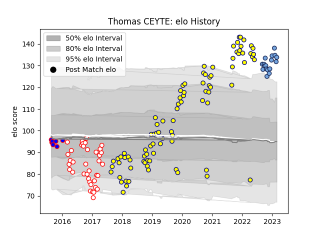

---  
layout: page  
title: Thomas CEYTE  
date: 2023-01-31 16:07:57.580019  
categories: player  
---
# Thomas CEYTE

## Positions: L

## Current elo: 142.0

## Current Percentile: 98.0

# Elo History

# Match History

| Team    |   Appearances |   Win Rate |
|:--------|--------------:|-----------:|
| Nevers  |            87 |   0.54023  |
| Dax     |            38 |   0.381579 |
| Bayonne |            14 |   0.678571 |
| Beziers |             7 |   0.571429 |

| Opponent                   |   Matches |   Win Rate |
|:---------------------------|----------:|-----------:|
| Mont-de-Marsan             |        10 |   0.6      |
| Montauban                  |        10 |   0.4      |
| Biarritz Olympique         |         9 |   0.555556 |
| Carcassonne                |         8 |   0.5      |
| Vannes                     |         8 |   0.5      |
| Beziers                    |         8 |   0.5625   |
| Aurillac                   |         7 |   0.714286 |
| Soyaux-Angouleme           |         7 |   0.428571 |
| Oyonnax                    |         7 |   0.428571 |
| Colomiers                  |         7 |   0.571429 |
| Provence Rugby             |         6 |   0.5      |
| Perpignan                  |         6 |   0.666667 |
| Bayonne                    |         5 |   0.3      |
| Narbonne                   |         5 |   0.6      |
| Agen                       |         4 |   0.25     |
| Brive                      |         4 |   0.25     |
| Grenoble                   |         4 |   0.25     |
| Albi                       |         3 |   0.166667 |
| Lyon                       |         3 |   0.333333 |
| Bourgoin-Jallieu           |         3 |   0.333333 |
| Rouen                      |         3 |   1        |
| Massy                      |         2 |   0.5      |
| US Bressane                |         2 |   1        |
| Toulon                     |         2 |   0.5      |
| Tarbes                     |         2 |   0        |
| Roval Drome XV             |         1 |   1        |
| Valence Romans Drome Rugby |         1 |   1        |
| Stade Toulousain           |         1 |   1        |
| La Rochelle                |         1 |   1        |
| Racing 92                  |         1 |   1        |
| Castres Olympique          |         1 |   0        |
| Pau                        |         1 |   0.5      |
| Clermont Auvergne          |         1 |   1        |
| Dax                        |         1 |   1        |
| Bordeaux Begles            |         1 |   1        |
| Montpellier Herault        |         1 |   0        |