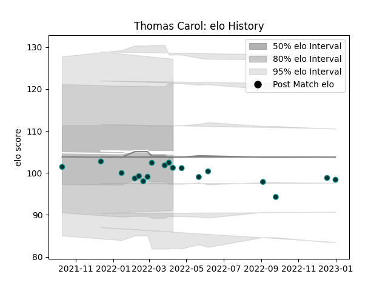

---  
layout: page  
title: Thomas Carol  
date: 2022-12-18 16:19:19.666859  
categories: player  
---
# Thomas Carol

## Positions: FB, W

## Current elo: 90.0

## Current Percentile: 13.0

# Elo History

# Match History

| Team   |   Appearances |   Win Rate |
|:-------|--------------:|-----------:|
| Pau    |            15 |        0.4 |

| Opponent             |   Matches |   Win Rate |
|:---------------------|----------:|-----------:|
| Montpellier Herault  |         2 |        0   |
| Perpignan            |         2 |        1   |
| Stade Toulousain     |         2 |        0.5 |
| Biarritz Olympique   |         1 |        1   |
| Bordeaux Begles      |         1 |        1   |
| Brive                |         1 |        0   |
| Castres Olympique    |         1 |        0   |
| Dragons              |         1 |        1   |
| La Rochelle          |         1 |        0   |
| Racing 92            |         1 |        0   |
| Stade Francais Paris |         1 |        0   |
| Toulon               |         1 |        0   |