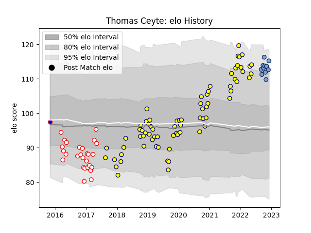

---  
layout: page  
title: Thomas Ceyte  
date: 2022-12-09 13:23:14.902371  
categories: player  
---
# Thomas Ceyte

## Positions: L

## Current elo: 115.0

## Current Percentile: 91.0

# Elo History

# Match History

| Team    |   Appearances |   Win Rate |
|:--------|--------------:|-----------:|
| Nevers  |            72 |   0.541667 |
| Dax     |            27 |   0.333333 |
| Bayonne |            11 |   0.636364 |
| Beziers |             1 |   0        |

| Opponent                   |   Matches |   Win Rate |
|:---------------------------|----------:|-----------:|
| Beziers                    |         8 |   0.5625   |
| Mont-de-Marsan             |         7 |   0.571429 |
| Carcassonne                |         7 |   0.428571 |
| Soyaux-Angouleme           |         6 |   0.333333 |
| Montauban                  |         6 |   0.5      |
| Colomiers                  |         6 |   0.5      |
| Vannes                     |         6 |   0.5      |
| Biarritz Olympique         |         6 |   0.5      |
| Bayonne                    |         5 |   0.3      |
| Aurillac                   |         5 |   0.6      |
| Perpignan                  |         5 |   0.6      |
| Oyonnax                    |         5 |   0.4      |
| Agen                       |         4 |   0.25     |
| Provence Rugby             |         4 |   0.5      |
| Rouen                      |         3 |   1        |
| Bourgoin-Jallieu           |         3 |   0.333333 |
| Narbonne                   |         3 |   0.333333 |
| Grenoble                   |         3 |   0.333333 |
| Lyon                       |         2 |   0.5      |
| Brive                      |         2 |   0        |
| US Bressane                |         2 |   1        |
| Bordeaux Begles            |         1 |   1        |
| Valence Romans Drome Rugby |         1 |   1        |
| Toulon                     |         1 |   0        |
| Tarbes                     |         1 |   0        |
| Stade Toulousain           |         1 |   1        |
| Massy                      |         1 |   1        |
| Roval Drome XV             |         1 |   1        |
| Albi                       |         1 |   0        |
| Racing 92                  |         1 |   1        |
| Clermont Auvergne          |         1 |   1        |
| La Rochelle                |         1 |   1        |
| Montpellier Herault        |         1 |   0        |
| Castres Olympique          |         1 |   0        |