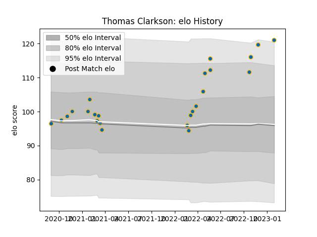

---  
layout: page  
title: Thomas Clarkson  
date: 2023-02-04 17:24:15.516198  
categories: player  
---
# Thomas Clarkson

## Positions: P

## Current elo: 121.0

## Current Percentile: 94.0

# Elo History

# Match History

| Team     |   Appearances |   Win Rate |
|:---------|--------------:|-----------:|
| Leinster |            24 |   0.833333 |

| Opponent         |   Matches |   Win Rate |
|:-----------------|----------:|-----------:|
| Munster          |         4 |   1        |
| Glasgow Warriors |         3 |   1        |
| Ulster           |         3 |   0.666667 |
| Benetton Treviso |         2 |   1        |
| Cardiff Blues    |         2 |   1        |
| Ospreys          |         2 |   0.5      |
| Scarlets         |         2 |   1        |
| Connacht         |         1 |   1        |
| Dragons          |         1 |   1        |
| Lions            |         1 |   1        |
| Sharks           |         1 |   0        |
| Stormers         |         1 |   0        |
| Zebre            |         1 |   1        |