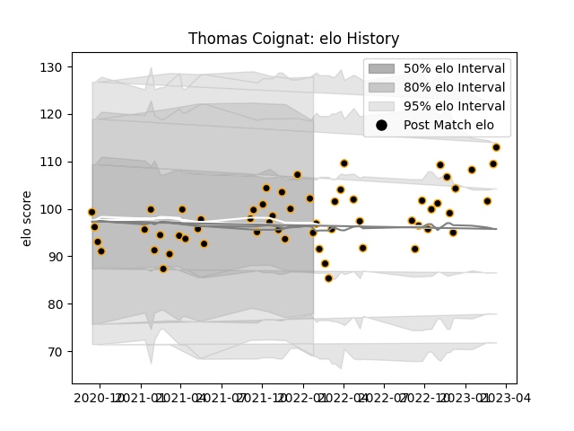

---  
layout: page  
title: Thomas Coignat  
date: 2023-01-17 11:39:57.785760  
categories: player  
---
# Thomas Coignat

## Positions: N8, FL

## Current elo: 100.0

## Current Percentile: 68.0

# Elo History

# Match History

| Team     |   Appearances |   Win Rate |
|:---------|--------------:|-----------:|
| Chambery |            54 |   0.490741 |

| Opponent                   |   Matches |   Win Rate |
|:---------------------------|----------:|-----------:|
| Bourgoin-Jallieu           |         5 |   0.4      |
| Dax                        |         5 |   0.2      |
| Tarbes                     |         5 |   0.6      |
| Albi                       |         4 |   0        |
| Aubenas                    |         4 |   0.5      |
| Nice                       |         4 |   0.5      |
| Suresnes                   |         4 |   0.75     |
| Blagnac                    |         3 |   0.333333 |
| Cognac Saint Jean d'Angély |         3 |   0.666667 |
| Dijon                      |         3 |   0.666667 |
| Massy                      |         3 |   0.5      |
| US Bressane                |         3 |   0.333333 |
| Valence Romans Drome Rugby |         3 |   0.333333 |
| Narbonne                   |         2 |   1        |
| Soyaux-Angouleme           |         2 |   1        |
| Rennes                     |         1 |   1        |