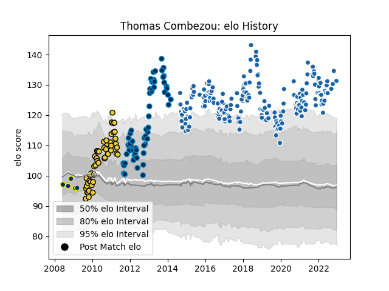

---  
layout: page  
title: Thomas Combezou  
date: 2022-12-18 16:17:45.541668  
categories: player  
---
# Thomas Combezou

## Positions: C, W

## Current elo: 131.0

## Current Percentile: 99.0

# Elo History

# Match History

| Team                |   Appearances |   Win Rate |
|:--------------------|--------------:|-----------:|
| Castres Olympique   |           211 |   0.511848 |
| Montpellier Herault |            63 |   0.587302 |
| La Rochelle         |            50 |   0.49     |
| Clermont Auvergne   |             5 |   0.2      |

| Opponent             |   Matches |   Win Rate |
|:---------------------|----------:|-----------:|
| Racing 92            |        22 |   0.318182 |
| Toulon               |        20 |   0.35     |
| Bordeaux Begles      |        20 |   0.575    |
| Stade Francais Paris |        18 |   0.444444 |
| Agen                 |        18 |   0.666667 |
| Stade Toulousain     |        18 |   0.583333 |
| Brive                |        17 |   0.411765 |
| Clermont Auvergne    |        17 |   0.470588 |
| Montpellier Herault  |        17 |   0.470588 |
| Pau                  |        16 |   0.71875  |
| La Rochelle          |        15 |   0.466667 |
| Lyon                 |        15 |   0.6      |
| Bayonne              |        12 |   0.541667 |
| Perpignan            |        11 |   0.454545 |
| Grenoble             |        11 |   0.863636 |
| Oyonnax              |         8 |   0.75     |
| Biarritz Olympique   |         6 |   0.666667 |
| Castres Olympique    |         6 |   0.333333 |
| Sale Sharks          |         5 |   0.4      |
| Munster              |         5 |   0.2      |
| Leinster             |         4 |   0.125    |
| Leicester Tigers     |         4 |   0.25     |
| Bourgoin-Jallieu     |         3 |   1        |
| Dragons              |         3 |   0.666667 |
| Harlequins           |         3 |   0        |
| Mont-de-Marsan       |         3 |   0.666667 |
| Exeter Chiefs        |         3 |   0.333333 |
| Tarbes               |         2 |   1        |
| Aurillac             |         2 |   0        |
| Auch                 |         2 |   1        |
| Dax                  |         2 |   1        |
| Lannemezan           |         2 |   1        |
| Northampton Saints   |         2 |   0.5      |
| Benetton Treviso     |         2 |   1        |
| Glasgow Warriors     |         2 |   0.25     |
| Wasps                |         2 |   0        |
| Narbonne             |         2 |   0.5      |
| Ulster               |         1 |   0        |
| Bath Rugby           |         1 |   1        |
| Colomiers            |         1 |   0        |
| Cardiff Blues        |         1 |   1        |
| RC Enisei            |         1 |   1        |
| Provence Rugby       |         1 |   1        |
| Montauban            |         1 |   0        |
| Gloucester Rugby     |         1 |   1        |
| Worcester Warriors   |         1 |   1        |