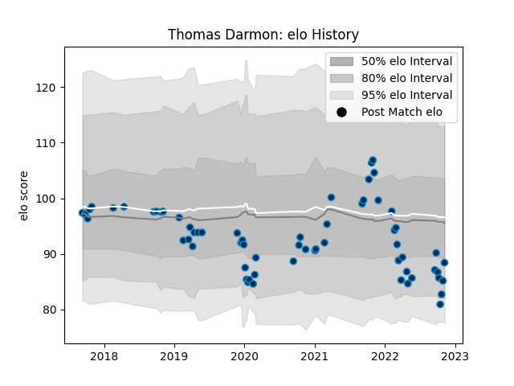

---  
layout: page  
title: Thomas Darmon  
date: 2022-11-16 11:34:58.087980  
categories: player  
---
# Thomas Darmon

## Positions: C, FH

## Current elo: 88.0

## Current Percentile: 15.0

# Elo History

# Match History

| Team                |   Appearances |   Win Rate |
|:--------------------|--------------:|-----------:|
| Montpellier Herault |            64 |   0.523438 |

| Opponent             |   Matches |   Win Rate |
|:---------------------|----------:|-----------:|
| Racing 92            |         7 |   0.285714 |
| Toulon               |         6 |   0.583333 |
| Lyon                 |         5 |   0.2      |
| Stade Toulousain     |         5 |   0.2      |
| Stade Francais Paris |         5 |   0.7      |
| Castres Olympique    |         5 |   0.6      |
| Pau                  |         5 |   0.8      |
| Brive                |         4 |   0.875    |
| Perpignan            |         3 |   0.666667 |
| Agen                 |         3 |   1        |
| Bordeaux Begles      |         3 |   0        |
| Bayonne              |         2 |   0.5      |
| La Rochelle          |         2 |   0        |
| Gloucester Rugby     |         2 |   0.5      |
| Clermont Auvergne    |         2 |   1        |
| Newcastle Falcons    |         1 |   0        |
| Oyonnax              |         1 |   1        |
| Connacht             |         1 |   1        |
| Biarritz Olympique   |         1 |   1        |
| Leinster             |         1 |   0        |