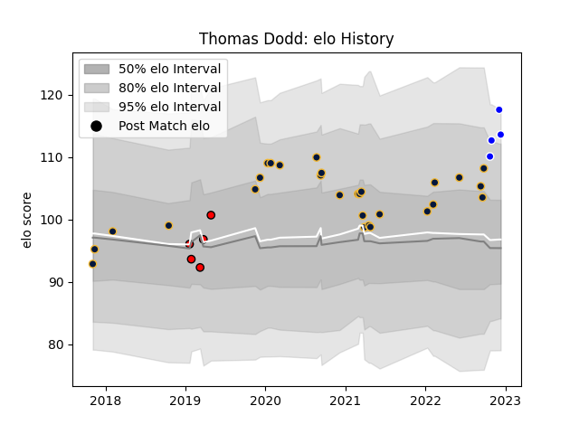

---  
layout: page  
title: Thomas Dodd  
date: 2023-01-21 15:41:32.061047  
categories: player  
---
# Thomas Dodd

## Positions: FL, N8

## Current elo: 96.0

## Current Percentile: 28.0

# Elo History

# Match History

| Team               |   Appearances |   Win Rate |
|:-------------------|--------------:|-----------:|
| Worcester Warriors |            28 |   0.25     |
| Coventry           |             7 |   0.785714 |
| Hartpury College   |             7 |   0.428571 |

| Opponent             |   Matches |   Win Rate |
|:---------------------|----------:|-----------:|
| Bath Rugby           |         5 |   0.2      |
| London Irish         |         3 |   0.333333 |
| Sale Sharks          |         3 |   0        |
| Wasps                |         2 |   0        |
| Richmond             |         2 |   1        |
| RC Enisei            |         2 |   1        |
| Nottingham           |         2 |   1        |
| Northampton Saints   |         2 |   0        |
| Newcastle Falcons    |         2 |   0.5      |
| Jersey               |         2 |   0.75     |
| Harlequins           |         2 |   0        |
| Dragons              |         2 |   0.5      |
| Doncaster            |         2 |   0.5      |
| Cornish Pirates      |         2 |   0.5      |
| Hartpury College     |         1 |   0        |
| Bristol Rugby        |         1 |   0        |
| Leicester Tigers     |         1 |   0        |
| Gloucester Rugby     |         1 |   0        |
| Exeter Chiefs        |         1 |   0        |
| Ealing Trailfinders  |         1 |   0        |
| Stade Francais Paris |         1 |   1        |
| Caldy                |         1 |   1        |
| Yorkshire Carnegie   |         1 |   0        |