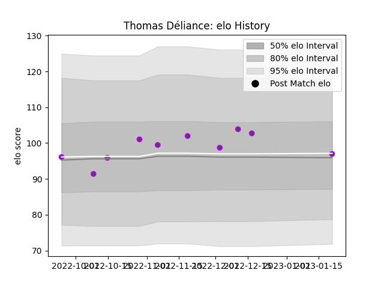

---  
layout: page  
title: Thomas Déliance  
date: 2023-03-17 17:11:21.061837  
categories: player  
---
# Thomas Déliance

## Positions: FL, L

## Current elo: 107.0

## Current Percentile: 81.0

# Elo History

# Match History

| Team        |   Appearances |   Win Rate |
|:------------|--------------:|-----------:|
| US Bressane |            15 |   0.733333 |

| Opponent                   |   Matches |   Win Rate |
|:---------------------------|----------:|-----------:|
| Blagnac                    |         2 |        0.5 |
| Carqueiranne-Hyères        |         2 |        0.5 |
| Nice                       |         2 |        0.5 |
| Rennes                     |         2 |        1   |
| Bourgoin-Jallieu           |         1 |        1   |
| Cognac Saint Jean d'Angély |         1 |        1   |
| Dax                        |         1 |        0   |
| Narbonne                   |         1 |        1   |
| Suresnes                   |         1 |        1   |
| Tarbes                     |         1 |        1   |
| Valence Romans Drome Rugby |         1 |        1   |