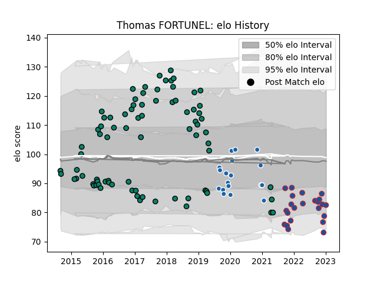

---  
layout: page  
title: Thomas FORTUNEL  
date: 2023-02-16 11:19:55.539615  
categories: player  
---
# Thomas FORTUNEL

## Positions: FH

## Current elo: 89.0

## Current Percentile: 18.0

# Elo History

# Match History

| Team              |   Appearances |   Win Rate |
|:------------------|--------------:|-----------:|
| Montauban         |            81 |   0.5      |
| Grenoble          |            26 |   0.5      |
| Castres Olympique |            19 |   0.394737 |

| Opponent                   |   Matches |   Win Rate |
|:---------------------------|----------:|-----------:|
| Carcassonne                |         9 |   0.722222 |
| Aurillac                   |         8 |   0.3125   |
| Provence Rugby             |         7 |   0.357143 |
| Perpignan                  |         7 |   0.428571 |
| Massy                      |         6 |   1        |
| Beziers                    |         6 |   0.416667 |
| Biarritz Olympique         |         6 |   0.25     |
| Colomiers                  |         6 |   0.333333 |
| Mont-de-Marsan             |         6 |   0.333333 |
| Vannes                     |         5 |   0.6      |
| Soyaux-Angouleme           |         5 |   0.8      |
| Agen                       |         4 |   0.5      |
| Dax                        |         4 |   0.25     |
| Narbonne                   |         4 |   0.625    |
| Nevers                     |         3 |   0.5      |
| Albi                       |         3 |   1        |
| Montauban                  |         3 |   0.833333 |
| Bayonne                    |         3 |   0        |
| Lyon                       |         2 |   0.5      |
| Grenoble                   |         2 |   0        |
| US Bressane                |         2 |   0        |
| Tarbes                     |         2 |   0.75     |
| Stade Toulousain           |         2 |   0.25     |
| Bordeaux Begles            |         2 |   0        |
| Rouen                      |         2 |   1        |
| Racing 92                  |         2 |   0        |
| RC Enisei                  |         2 |   1        |
| Dragons                    |         2 |   0.5      |
| Bourgoin-Jallieu           |         1 |   1        |
| Brive                      |         1 |   0        |
| Pau                        |         1 |   0        |
| Oyonnax                    |         1 |   0        |
| Ospreys                    |         1 |   0        |
| Clermont Auvergne          |         1 |   0        |
| Toulon                     |         1 |   0        |
| Montpellier Herault        |         1 |   1        |
| Valence Romans Drome Rugby |         1 |   1        |
| Enisey-STM Krasnoyarsk     |         1 |   1        |
| Worcester Warriors         |         1 |   1        |