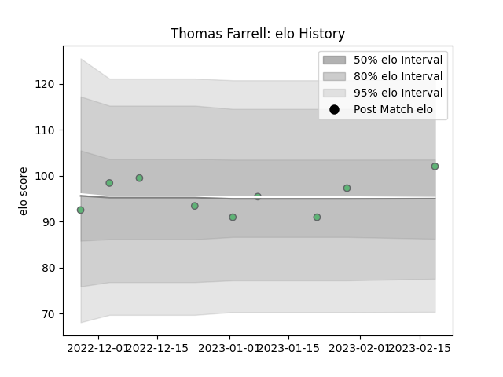

---  
layout: page  
title: Thomas Farrell  
date: 2023-02-24 02:26:54.708736  
categories: player  
---
# Thomas Farrell

## Positions: C

## Current elo: 102.0

## Current Percentile: 56.0

# Elo History

# Match History

| Team     |   Appearances |   Win Rate |
|:---------|--------------:|-----------:|
| Connacht |             9 |   0.555556 |

| Opponent          |   Matches |   Win Rate |
|:------------------|----------:|-----------:|
| Newcastle Falcons |         2 |        0.5 |
| Benetton Treviso  |         1 |        1   |
| Leinster          |         1 |        0   |
| Lions             |         1 |        1   |
| Munster           |         1 |        0   |
| Sharks            |         1 |        1   |
| Ulster            |         1 |        0   |
| Zebre             |         1 |        1   |