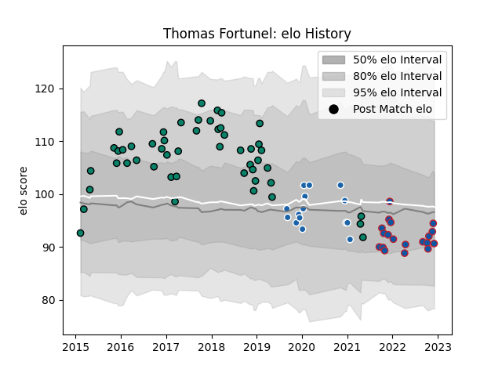

---  
layout: page  
title: Thomas Fortunel  
date: 2022-12-09 13:13:00.403812  
categories: player  
---
# Thomas Fortunel

## Positions: FH

## Current elo: 91.0

## Current Percentile: 41.0

# Elo History

# Match History

| Team              |   Appearances |   Win Rate |
|:------------------|--------------:|-----------:|
| Montauban         |            50 |   0.48     |
| Grenoble          |            19 |   0.473684 |
| Castres Olympique |            15 |   0.366667 |

| Opponent                   |   Matches |   Win Rate |
|:---------------------------|----------:|-----------:|
| Biarritz Olympique         |         6 |   0.25     |
| Beziers                    |         5 |   0.3      |
| Carcassonne                |         5 |   0.6      |
| Colomiers                  |         5 |   0.2      |
| Perpignan                  |         5 |   0.4      |
| Aurillac                   |         5 |   0.4      |
| Vannes                     |         4 |   0.75     |
| Provence Rugby             |         4 |   0.25     |
| Massy                      |         4 |   1        |
| Montauban                  |         3 |   0.833333 |
| Soyaux-Angouleme           |         3 |   0.666667 |
| Nevers                     |         3 |   0.5      |
| Narbonne                   |         3 |   0.833333 |
| Mont-de-Marsan             |         2 |   0.5      |
| Racing 92                  |         2 |   0        |
| RC Enisei                  |         2 |   1        |
| Agen                       |         2 |   0.5      |
| Bordeaux Begles            |         2 |   0        |
| Dragons                    |         2 |   0.5      |
| Bayonne                    |         2 |   0        |
| Lyon                       |         1 |   1        |
| Valence Romans Drome Rugby |         1 |   1        |
| US Bressane                |         1 |   0        |
| Toulon                     |         1 |   0        |
| Tarbes                     |         1 |   0.5      |
| Stade Toulousain           |         1 |   0.5      |
| Rouen                      |         1 |   1        |
| Grenoble                   |         1 |   0        |
| Bourgoin-Jallieu           |         1 |   1        |
| Brive                      |         1 |   0        |
| Clermont Auvergne          |         1 |   0        |
| Dax                        |         1 |   0        |
| Oyonnax                    |         1 |   0        |
| Ospreys                    |         1 |   0        |
| Worcester Warriors         |         1 |   1        |