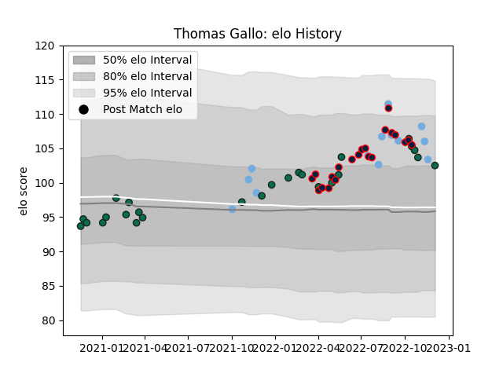

---  
layout: page  
title: Thomas Gallo  
date: 2023-01-30 11:44:48.713175  
categories: player  
---
# Thomas Gallo

## Positions: P

## Country: Argentina

## Current elo: 100.0

## Current Percentile: 68.0

# Elo History

# Match History

| Team             |   Appearances |   Win Rate |
|:-----------------|--------------:|-----------:|
| Benetton Treviso |            27 |   0.166667 |
| Buenos Aires     |            21 |   0.380952 |
| Argentina        |            14 |   0.357143 |

| Opponent             |   Matches |   Win Rate |
|:---------------------|----------:|-----------:|
| Zebre                |         4 |   0.5      |
| Australia            |         4 |   0.25     |
| Cardiff Blues        |         3 |   0.333333 |
| Connacht             |         3 |   0        |
| Dragons              |         3 |   0.5      |
| Glasgow Warriors     |         3 |   0        |
| Munster              |         3 |   0        |
| Atlético del Rosario |         2 |   0.5      |
| Scotland             |         2 |   0.5      |
| Scarlets             |         2 |   0        |
| San Luis             |         2 |   1        |
| Regatas Bella Vista  |         2 |   0        |
| Pucara               |         2 |   0.5      |
| Newman               |         2 |   0        |
| New Zealand          |         2 |   0.5      |
| Alumni               |         2 |   0.5      |
| CUBA                 |         2 |   0        |
| CASI                 |         2 |   1        |
| Hindu                |         2 |   0        |
| Edinburgh            |         2 |   0        |
| Wales                |         1 |   0        |
| South Africa         |         1 |   0        |
| Sharks               |         1 |   0        |
| Belgrano             |         1 |   0        |
| Bulls                |         1 |   0        |
| Ireland              |         1 |   0        |
| SIC                  |         1 |   0        |
| Lions                |         1 |   0        |
| Ospreys              |         1 |   0        |
| England              |         1 |   1        |
| France               |         1 |   0        |
| Los Tilos            |         1 |   1        |
| Italy                |         1 |   1        |