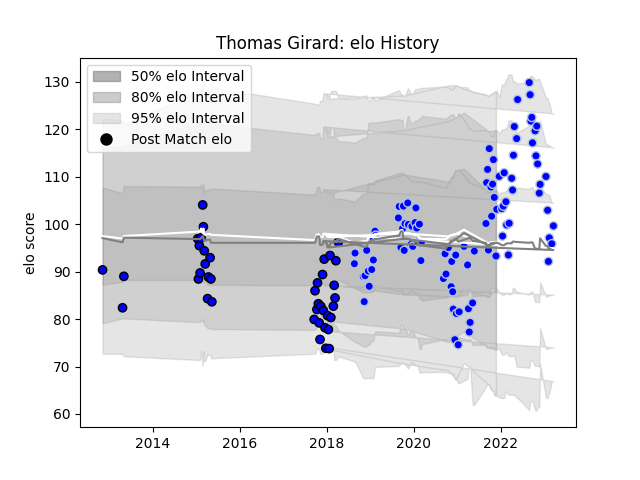

---  
layout: page  
title: Thomas Girard  
date: 2023-03-21 18:29:42.347895  
categories: player  
---
# Thomas Girard

Last updated: 2023-03-21
## Positions: FB

## Current elo: 93.0

## Current Percentile: 72.0

# Elo History

# Match History

| Team      |   Appearances |   Win Rate |
|:----------|--------------:|-----------:|
| Colomiers |            96 |   0.619792 |
| Massy     |            40 |   0.375    |

| Opponent                   |   Matches |   Win Rate |
|:---------------------------|----------:|-----------:|
| Aurillac                   |        11 |   0.545455 |
| Vannes                     |        10 |   0.4      |
| Oyonnax                    |        10 |   0.45     |
| Mont-de-Marsan             |        10 |   0.6      |
| Nevers                     |         9 |   0.777778 |
| Carcassonne                |         8 |   0.5      |
| Montauban                  |         8 |   0.375    |
| Beziers                    |         8 |   0.375    |
| Soyaux-Angouleme           |         7 |   0.571429 |
| Provence Rugby             |         7 |   0.714286 |
| Grenoble                   |         6 |   1        |
| Rouen                      |         6 |   0.833333 |
| Biarritz Olympique         |         6 |   0.5      |
| Narbonne                   |         5 |   0.6      |
| Perpignan                  |         4 |   0.5      |
| Bayonne                    |         3 |   0.333333 |
| Agen                       |         3 |   0.666667 |
| Dax                        |         3 |   0.333333 |
| Pau                        |         2 |   0        |
| Colomiers                  |         2 |   0.5      |
| Roval Drome XV             |         2 |   1        |
| Brive                      |         2 |   0.5      |
| Albi                       |         1 |   0        |
| Massy                      |         1 |   0        |
| Tarbes                     |         1 |   1        |
| Valence Romans Drome Rugby |         1 |   0        |