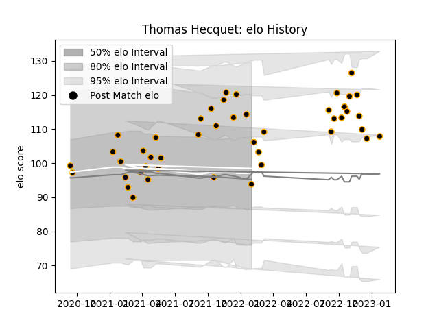

---  
layout: page  
title: Thomas Hecquet  
date: 2022-11-22 11:30:10.540772  
categories: player  
---
# Thomas Hecquet

## Positions: W, FB

## Current elo: 95.0

## Current Percentile: 66.0

# Elo History

# Match History

| Team     |   Appearances |   Win Rate |
|:---------|--------------:|-----------:|
| Chambery |            36 |   0.486111 |

| Opponent                   |   Matches |   Win Rate |
|:---------------------------|----------:|-----------:|
| Dax                        |         5 |   0.2      |
| Aubenas                    |         3 |   0.333333 |
| Blagnac                    |         3 |   0.333333 |
| Dijon                      |         3 |   0.333333 |
| Nice                       |         3 |   0.333333 |
| Tarbes                     |         3 |   1        |
| Albi                       |         2 |   0        |
| Cognac Saint Jean d'Angély |         2 |   1        |
| Massy                      |         2 |   0.75     |
| Narbonne                   |         2 |   1        |
| Soyaux-Angouleme           |         2 |   1        |
| US Bressane                |         2 |   0        |
| Bourgoin-Jallieu           |         1 |   0        |
| Carqueiranne-Hyères        |         1 |   0        |
| Rennes                     |         1 |   1        |
| Suresnes                   |         1 |   1        |