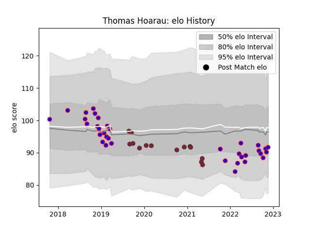

---  
layout: page  
title: Thomas Hoarau  
date: 2023-01-30 11:45:40.534403  
categories: player  
---
# Thomas Hoarau

## Positions: N8, FL

## Current elo: 101.0

## Current Percentile: 37.0

# Elo History

# Match History

| Team    |   Appearances |   Win Rate |
|:--------|--------------:|-----------:|
| Beziers |            50 |     0.52   |
| Toulon  |            16 |     0.5625 |

| Opponent             |   Matches |   Win Rate |
|:---------------------|----------:|-----------:|
| Montauban            |         5 |   0.8      |
| Mont-de-Marsan       |         4 |   0.5      |
| Provence Rugby       |         4 |   0.5      |
| Vannes               |         4 |   0.5      |
| Bayonne              |         4 |   0.5      |
| Agen                 |         3 |   1        |
| Carcassonne          |         3 |   0.333333 |
| Colomiers            |         3 |   0.333333 |
| US Bressane          |         3 |   0.333333 |
| Stade Francais Paris |         3 |   0.666667 |
| Aurillac             |         3 |   0.333333 |
| Brive                |         3 |   0.333333 |
| Nevers               |         3 |   0.5      |
| Rouen                |         2 |   0.5      |
| Stade Toulousain     |         2 |   0.5      |
| Soyaux-Angouleme     |         2 |   0.5      |
| Massy                |         2 |   1        |
| Biarritz Olympique   |         2 |   0.5      |
| Oyonnax              |         2 |   0.25     |
| Scarlets             |         1 |   1        |
| Bordeaux Begles      |         1 |   0        |
| Racing 92            |         1 |   1        |
| Montpellier Herault  |         1 |   0        |
| Lyon                 |         1 |   0        |
| La Rochelle          |         1 |   1        |
| Grenoble             |         1 |   0        |
| Dax                  |         1 |   1        |
| Narbonne             |         1 |   1        |