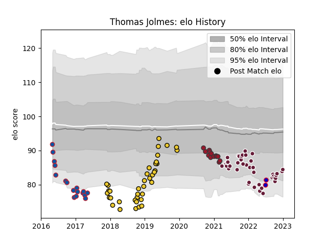

---  
layout: page  
title: Thomas Jolmes  
date: 2023-02-02 18:52:00.911344  
categories: player  
---
# Thomas Jolmes

## Positions: L

## Country: France

## Current elo: 83.0

## Current Percentile: 17.0

# Elo History

# Match History

| Team            |   Appearances |   Win Rate |
|:----------------|--------------:|-----------:|
| Bordeaux Begles |            45 |   0.555556 |
| La Rochelle     |            38 |   0.671053 |
| Grenoble        |            17 |   0.205882 |
| Toulon          |            13 |   0.461538 |
| France          |             2 |   1        |

| Opponent             |   Matches |   Win Rate |
|:---------------------|----------:|-----------:|
| Castres Olympique    |        10 |   0.65     |
| Montpellier Herault  |         9 |   0.555556 |
| Stade Toulousain     |         8 |   0.125    |
| Lyon                 |         7 |   0.571429 |
| Toulon               |         7 |   0.5      |
| Brive                |         7 |   0.571429 |
| Pau                  |         7 |   0.714286 |
| Stade Francais Paris |         6 |   0.666667 |
| Clermont Auvergne    |         6 |   0.416667 |
| Racing 92            |         6 |   0.833333 |
| Bayonne              |         5 |   0.4      |
| Agen                 |         5 |   0.8      |
| Bordeaux Begles      |         5 |   0.2      |
| La Rochelle          |         4 |   0.25     |
| Perpignan            |         3 |   0.666667 |
| Ospreys              |         2 |   0        |
| Biarritz Olympique   |         2 |   0.5      |
| RC Enisei            |         2 |   1        |
| Japan                |         2 |   1        |
| Wasps                |         2 |   0.5      |
| Oyonnax              |         1 |   0.5      |
| Gloucester Rugby     |         1 |   0        |
| Newcastle Falcons    |         1 |   1        |
| Leicester Tigers     |         1 |   0        |
| Glasgow Warriors     |         1 |   0        |
| Sale Sharks          |         1 |   1        |
| Scarlets             |         1 |   1        |
| Sharks               |         1 |   0        |
| Bristol Rugby        |         1 |   1        |
| Grenoble             |         1 |   1        |