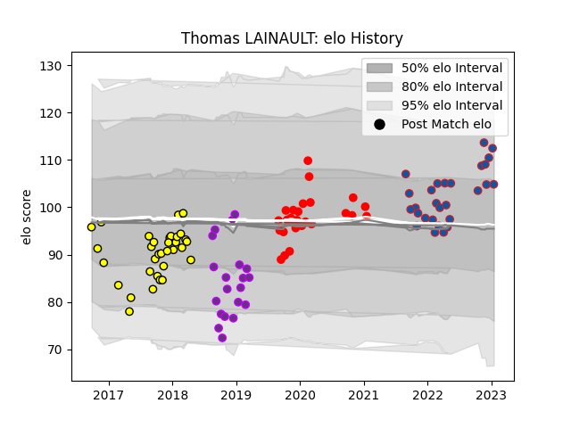

---  
layout: page  
title: Thomas LAINAULT  
date: 2023-02-24 02:28:41.535342  
categories: player  
---
# Thomas LAINAULT

## Positions: L

## Current elo: 101.0

## Current Percentile: 76.0

# Elo History

# Match History

| Team        |   Appearances |   Win Rate |
|:------------|--------------:|-----------:|
| Carcassonne |            33 |   0.333333 |
| Grenoble    |            31 |   0.467742 |
| Rouen       |            26 |   0.326923 |
| US Bressane |            20 |   0.475    |

| Opponent                   |   Matches |   Win Rate |
|:---------------------------|----------:|-----------:|
| Colomiers                  |        10 |   0.3      |
| Aurillac                   |         8 |   0.375    |
| Provence Rugby             |         8 |   0.25     |
| Nevers                     |         7 |   0.5      |
| Mont-de-Marsan             |         6 |   0.166667 |
| Soyaux-Angouleme           |         6 |   0.333333 |
| Biarritz Olympique         |         6 |   0.416667 |
| Massy                      |         5 |   0.6      |
| Perpignan                  |         5 |   0.2      |
| Oyonnax                    |         5 |   0.4      |
| Vannes                     |         5 |   0.7      |
| Carcassonne                |         5 |   0.7      |
| Bayonne                    |         5 |   0.4      |
| Montauban                  |         4 |   0.5      |
| Beziers                    |         4 |   0        |
| Grenoble                   |         3 |   0        |
| Narbonne                   |         3 |   0.5      |
| Agen                       |         3 |   0.333333 |
| Brive                      |         2 |   0.5      |
| Rouen                      |         2 |   0.5      |
| Roval Drome XV             |         2 |   1        |
| US Bressane                |         2 |   0.5      |
| Valence Romans Drome Rugby |         2 |   0.5      |
| Albi                       |         1 |   0        |
| Dax                        |         1 |   1        |