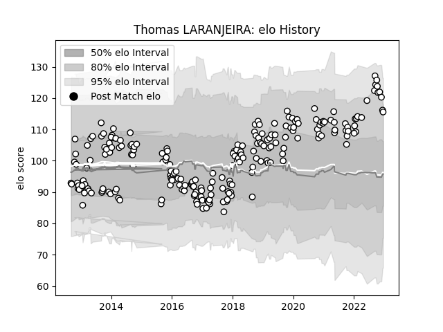

---  
layout: page  
title: Thomas LARANJEIRA  
date: 2023-03-30 11:33:58.866394  
categories: player  
---
# Thomas LARANJEIRA

Last updated: 2023-03-30
## Positions: FB, FH

## Current elo: 116.0

## Current Percentile: 86.0

# Elo History

# Match History

| Team   |   Appearances |   Win Rate |
|:-------|--------------:|-----------:|
| Brive  |           221 |   0.504525 |

| Opponent               |   Matches |   Win Rate |
|:-----------------------|----------:|-----------:|
| Pau                    |        15 |   0.533333 |
| La Rochelle            |        13 |   0.384615 |
| Clermont Auvergne      |        13 |   0.307692 |
| Toulon                 |        13 |   0.461538 |
| Stade Francais Paris   |        12 |   0.583333 |
| Bordeaux Begles        |        12 |   0.375    |
| Lyon                   |        11 |   0.409091 |
| Montpellier Herault    |        10 |   0.5      |
| Stade Toulousain       |         9 |   0.444444 |
| Racing 92              |         9 |   0.166667 |
| Oyonnax                |         8 |   0.625    |
| Agen                   |         8 |   0.5      |
| Bayonne                |         6 |   0.416667 |
| Grenoble               |         6 |   0.75     |
| Castres Olympique      |         5 |   0.6      |
| Biarritz Olympique     |         5 |   0.5      |
| Carcassonne            |         4 |   0.25     |
| Colomiers              |         4 |   0.75     |
| Connacht               |         4 |   0.25     |
| Newcastle Falcons      |         4 |   0.5      |
| Massy                  |         3 |   0.666667 |
| Perpignan              |         3 |   0.666667 |
| Aurillac               |         3 |   0.666667 |
| Enisey-STM Krasnoyarsk |         3 |   0.666667 |
| Provence Rugby         |         3 |   0.666667 |
| RC Enisei              |         3 |   0.666667 |
| Vannes                 |         3 |   1        |
| Tarbes                 |         2 |   1        |
| Worcester Warriors     |         2 |   1        |
| Mont-de-Marsan         |         2 |   0.5      |
| Nevers                 |         2 |   1        |
| Bucuresti              |         2 |   1        |
| Montauban              |         2 |   0.5      |
| Calvisano              |         2 |   0.75     |
| Albi                   |         2 |   1        |
| US Bressane            |         2 |   0.5      |
| Dax                    |         2 |   0.5      |
| Bath Rugby             |         2 |   0        |
| Auch                   |         1 |   1        |
| Cardiff Blues          |         1 |   0        |
| Soyaux-Angouleme       |         1 |   1        |
| Beziers                |         1 |   1        |
| Edinburgh              |         1 |   0        |
| Dragons                |         1 |   0        |
| Narbonne               |         1 |   0        |