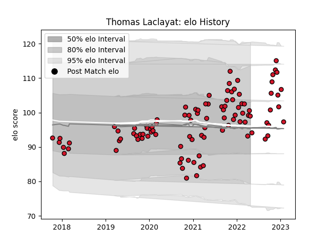

---  
layout: page  
title: Thomas Laclayat  
date: 2022-12-18 16:35:21.332914  
categories: player  
---
# Thomas Laclayat

## Positions: P

## Current elo: 104.0

## Current Percentile: 77.0

# Elo History

# Match History

| Team    |   Appearances |   Win Rate |
|:--------|--------------:|-----------:|
| Oyonnax |            61 |   0.696721 |

| Opponent                   |   Matches |   Win Rate |
|:---------------------------|----------:|-----------:|
| Grenoble                   |         5 |      0.6   |
| Provence Rugby             |         5 |      0.7   |
| Mont-de-Marsan             |         4 |      0.5   |
| Beziers                    |         4 |      0.875 |
| Biarritz Olympique         |         4 |      0.25  |
| Colomiers                  |         4 |      0.375 |
| Vannes                     |         3 |      1     |
| Nevers                     |         3 |      1     |
| Montauban                  |         3 |      1     |
| Agen                       |         3 |      1     |
| Carcassonne                |         3 |      1     |
| Connacht                   |         2 |      0     |
| Aurillac                   |         2 |      0.5   |
| Rouen                      |         2 |      1     |
| Soyaux-Angouleme           |         2 |      1     |
| US Bressane                |         2 |      1     |
| Valence Romans Drome Rugby |         2 |      1     |
| Bayonne                    |         2 |      0.5   |
| Worcester Warriors         |         2 |      0.5   |
| Clermont Auvergne          |         1 |      1     |
| Perpignan                  |         1 |      0     |
| Brive                      |         1 |      0     |
| Stade Francais Paris       |         1 |      1     |