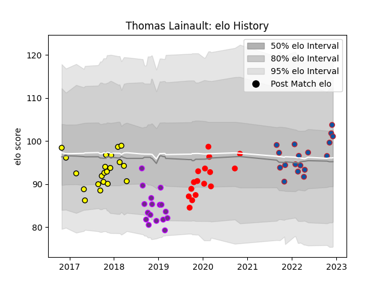

---  
layout: page  
title: Thomas Lainault  
date: 2022-12-12 15:05:08.986581  
categories: player  
---
# Thomas Lainault

## Positions: L

## Current elo: 101.0

## Current Percentile: 78.0

# Elo History

# Match History

| Team        |   Appearances |   Win Rate |
|:------------|--------------:|-----------:|
| Carcassonne |            21 |   0.285714 |
| Grenoble    |            18 |   0.388889 |
| US Bressane |            17 |   0.382353 |
| Rouen       |            16 |   0.375    |

| Opponent                   |   Matches |   Win Rate |
|:---------------------------|----------:|-----------:|
| Colomiers                  |         9 |   0.222222 |
| Aurillac                   |         5 |   0.4      |
| Soyaux-Angouleme           |         5 |   0.2      |
| Biarritz Olympique         |         5 |   0.5      |
| Perpignan                  |         5 |   0.2      |
| Bayonne                    |         4 |   0.5      |
| Nevers                     |         4 |   0.25     |
| Montauban                  |         4 |   0.5      |
| Mont-de-Marsan             |         3 |   0        |
| Carcassonne                |         3 |   0.666667 |
| Provence Rugby             |         3 |   0        |
| Narbonne                   |         2 |   0.25     |
| Roval Drome XV             |         2 |   1        |
| Oyonnax                    |         2 |   0.5      |
| Vannes                     |         2 |   0.25     |
| Massy                      |         2 |   1        |
| Grenoble                   |         2 |   0        |
| Brive                      |         2 |   0.5      |
| Beziers                    |         2 |   0        |
| Albi                       |         1 |   0        |
| Dax                        |         1 |   1        |
| Rouen                      |         1 |   0        |
| US Bressane                |         1 |   1        |
| Valence Romans Drome Rugby |         1 |   1        |
| Agen                       |         1 |   0        |