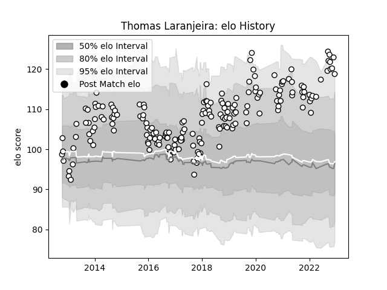

---  
layout: page  
title: Thomas Laranjeira  
date: 2022-12-14 11:32:11.406569  
categories: player  
---
# Thomas Laranjeira

## Positions: FB, FH

## Current elo: 119.0

## Current Percentile: 96.0

# Elo History

# Match History

| Team   |   Appearances |   Win Rate |
|:-------|--------------:|-----------:|
| Brive  |           190 |   0.486842 |

| Opponent             |   Matches |   Win Rate |
|:---------------------|----------:|-----------:|
| Pau                  |        14 |   0.5      |
| Toulon               |        13 |   0.461538 |
| Clermont Auvergne    |        12 |   0.25     |
| Bordeaux Begles      |        12 |   0.375    |
| La Rochelle          |        12 |   0.416667 |
| Lyon                 |        10 |   0.4      |
| Montpellier Herault  |        10 |   0.5      |
| Stade Francais Paris |         9 |   0.555556 |
| Racing 92            |         8 |   0.125    |
| Agen                 |         8 |   0.5      |
| Stade Toulousain     |         7 |   0.571429 |
| Oyonnax              |         6 |   0.833333 |
| Castres Olympique    |         5 |   0.6      |
| Biarritz Olympique   |         5 |   0.5      |
| Newcastle Falcons    |         4 |   0.5      |
| Grenoble             |         4 |   0.625    |
| Bayonne              |         4 |   0.375    |
| Connacht             |         3 |   0.333333 |
| Aurillac             |         3 |   0.666667 |
| RC Enisei            |         3 |   0.666667 |
| Carcassonne          |         3 |   0.333333 |
| Vannes               |         2 |   1        |
| US Bressane          |         2 |   0.5      |
| Tarbes               |         2 |   1        |
| Bath Rugby           |         2 |   0        |
| Provence Rugby       |         2 |   0.5      |
| Perpignan            |         2 |   0.5      |
| Nevers               |         2 |   1        |
| Montauban            |         2 |   0.5      |
| Mont-de-Marsan       |         2 |   0.5      |
| Massy                |         2 |   0.5      |
| Bucuresti            |         2 |   1        |
| Colomiers            |         2 |   0.5      |
| Calvisano            |         2 |   0.75     |
| Worcester Warriors   |         2 |   1        |
| Cardiff Blues        |         1 |   0        |
| Beziers              |         1 |   1        |
| Albi                 |         1 |   1        |
| Soyaux-Angouleme     |         1 |   1        |
| Edinburgh            |         1 |   0        |
| Dragons              |         1 |   0        |
| Dax                  |         1 |   0        |