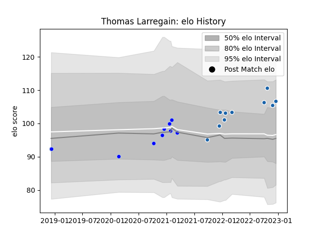

---  
layout: page  
title: Thomas Larregain  
date: 2023-01-17 11:36:44.366182  
categories: player  
---
# Thomas Larregain

## Positions: FB

## Current elo: 93.0

## Current Percentile: 37.0

# Elo History

# Match History

| Team              |   Appearances |   Win Rate |
|:------------------|--------------:|-----------:|
| Colomiers         |            13 |  0.307692  |
| Castres Olympique |            11 |  0.0909091 |

| Opponent                   |   Matches |   Win Rate |
|:---------------------------|----------:|-----------:|
| Munster                    |         2 |          0 |
| Biarritz Olympique         |         2 |          0 |
| Edinburgh                  |         2 |          0 |
| Harlequins                 |         2 |          0 |
| Perpignan                  |         2 |          0 |
| Bayonne                    |         1 |          0 |
| Toulon                     |         1 |          0 |
| Stade Francais Paris       |         1 |          0 |
| Roval Drome XV             |         1 |          1 |
| Provence Rugby             |         1 |          1 |
| Nevers                     |         1 |          0 |
| Montauban                  |         1 |          0 |
| Montpellier Herault        |         1 |          1 |
| Beziers                    |         1 |          0 |
| Mont-de-Marsan             |         1 |          0 |
| La Rochelle                |         1 |          0 |
| Grenoble                   |         1 |          0 |
| Carcassonne                |         1 |          1 |
| Valence Romans Drome Rugby |         1 |          1 |