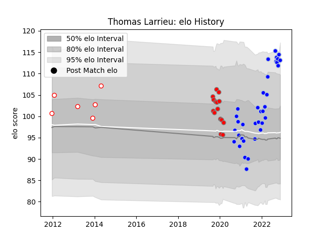

---  
layout: page  
title: Thomas Larrieu  
date: 2022-11-22 11:33:52.601119  
categories: player  
---
# Thomas Larrieu

## Positions: H

## Current elo: 113.0

## Current Percentile: 93.0

# Elo History

# Match History

| Team           |   Appearances |   Win Rate |
|:---------------|--------------:|-----------:|
| Colomiers      |            35 |   0.571429 |
| Roval Drome XV |            15 |   0.2      |
| Dax            |             6 |   0.166667 |

| Opponent                   |   Matches |   Win Rate |
|:---------------------------|----------:|-----------:|
| Beziers                    |         6 |   0.5      |
| Carcassonne                |         5 |   0.2      |
| Montauban                  |         4 |   0        |
| Provence Rugby             |         4 |   0.5      |
| Aurillac                   |         4 |   0.75     |
| Vannes                     |         4 |   0.25     |
| Colomiers                  |         3 |   0        |
| Mont-de-Marsan             |         3 |   0.666667 |
| Rouen                      |         3 |   0.333333 |
| Soyaux-Angouleme           |         3 |   1        |
| Grenoble                   |         2 |   0.5      |
| Nevers                     |         2 |   1        |
| Oyonnax                    |         2 |   1        |
| Perpignan                  |         2 |   0        |
| Valence Romans Drome Rugby |         2 |   0.5      |
| Agen                       |         2 |   0.5      |
| Lyon                       |         1 |   0        |
| Biarritz Olympique         |         1 |   0        |
| Pau                        |         1 |   0        |
| Bayonne                    |         1 |   0        |
| US Bressane                |         1 |   1        |