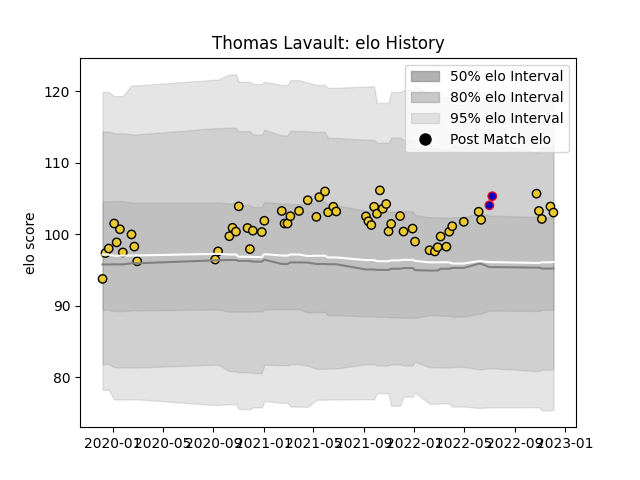

---  
layout: page  
title: Thomas Lavault  
date: 2022-12-09 13:18:57.106827  
categories: player  
---
# Thomas Lavault

## Positions: L

## Country: France

## Current elo: 103.0

## Current Percentile: 78.0

# Elo History

# Match History

| Team        |   Appearances |   Win Rate |
|:------------|--------------:|-----------:|
| La Rochelle |            62 |   0.580645 |
| France      |             2 |   1        |

| Opponent             |   Matches |   Win Rate |
|:---------------------|----------:|-----------:|
| Stade Toulousain     |         7 |   0        |
| Pau                  |         6 |   0.833333 |
| Toulon               |         5 |   0.8      |
| Bordeaux Begles      |         5 |   0.8      |
| Castres Olympique    |         5 |   0.6      |
| Racing 92            |         5 |   0.6      |
| Montpellier Herault  |         4 |   0.5      |
| Brive                |         4 |   1        |
| Stade Francais Paris |         4 |   0.25     |
| Lyon                 |         4 |   0.75     |
| Clermont Auvergne    |         3 |   0.333333 |
| Agen                 |         2 |   1        |
| Glasgow Warriors     |         2 |   0.5      |
| Biarritz Olympique   |         2 |   0.5      |
| Japan                |         2 |   1        |
| Bayonne              |         1 |   1        |
| Perpignan            |         1 |   0        |
| Sale Sharks          |         1 |   1        |
| Exeter Chiefs        |         1 |   0        |