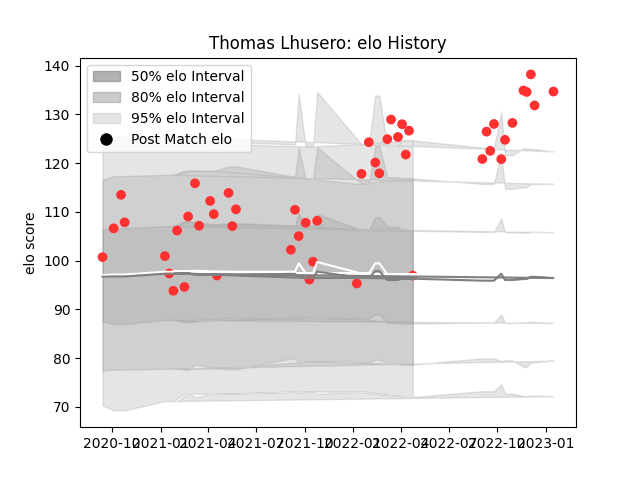

---  
layout: page  
title: Thomas Lhusero  
date: 2022-12-18 16:19:18.952654  
categories: player  
---
# Thomas Lhusero

## Positions: SH, FH

## Current elo: 115.0

## Current Percentile: 95.0

# Elo History

# Match History

| Team   |   Appearances |   Win Rate |
|:-------|--------------:|-----------:|
| Tarbes |            42 |   0.571429 |

| Opponent                   |   Matches |   Win Rate |
|:---------------------------|----------:|-----------:|
| Cognac Saint Jean d'Angély |         5 |   0.9      |
| Bourgoin-Jallieu           |         4 |   1        |
| Dax                        |         4 |   0.25     |
| Valence Romans Drome Rugby |         3 |   0.333333 |
| Narbonne                   |         3 |   0.333333 |
| Chambery                   |         3 |   0.333333 |
| Aubenas                    |         3 |   0.666667 |
| Massy                      |         3 |   0.333333 |
| US Bressane                |         2 |   0.5      |
| Suresnes                   |         2 |   0.5      |
| Albi                       |         2 |   1        |
| Blagnac                    |         2 |   0.5      |
| Dijon                      |         2 |   0.75     |
| Nice                       |         1 |   0        |
| Rennes                     |         1 |   1        |
| Soyaux-Angouleme           |         1 |   1        |
| Carqueiranne-Hyères        |         1 |   0        |