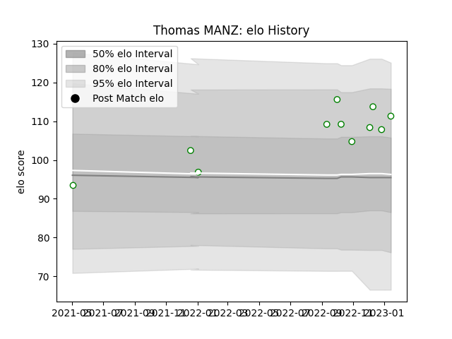

---  
layout: page  
title: Thomas MANZ  
date: 2023-01-21 15:41:50.429738  
categories: player  
---
# Thomas MANZ

## Positions: L

## Current elo: 111.0

## Current Percentile: 78.0

# Elo History

# Match History

| Team       |   Appearances |   Win Rate |
|:-----------|--------------:|-----------:|
| Nottingham |            11 |   0.181818 |

| Opponent            |   Matches |   Win Rate |
|:--------------------|----------:|-----------:|
| Hartpury College    |         2 |          0 |
| Ampthill            |         1 |          0 |
| Bedford             |         1 |          0 |
| Cornish Pirates     |         1 |          0 |
| Coventry            |         1 |          0 |
| Doncaster           |         1 |          1 |
| Ealing Trailfinders |         1 |          0 |
| Jersey              |         1 |          0 |
| London Scottish     |         1 |          1 |
| Saracens            |         1 |          0 |