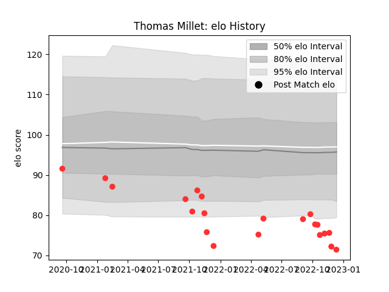

---  
layout: page  
title: Thomas Millet  
date: 2022-12-18 16:40:06.745097  
categories: player  
---
# Thomas Millet

## Positions: SH

## Current elo: 71.0

## Current Percentile: 1.0

# Elo History

# Match History

| Team   |   Appearances |   Win Rate |
|:-------|--------------:|-----------:|
| Tarbes |            21 |   0.309524 |

| Opponent                   |   Matches |   Win Rate |
|:---------------------------|----------:|-----------:|
| Nice                       |         3 |   0.166667 |
| Albi                       |         2 |   1        |
| Blagnac                    |         2 |   0        |
| Chambery                   |         2 |   0        |
| Suresnes                   |         2 |   0        |
| US Bressane                |         2 |   0        |
| Aubenas                    |         1 |   0        |
| Carqueiranne-Hyères        |         1 |   0        |
| Cognac Saint Jean d'Angély |         1 |   1        |
| Dax                        |         1 |   1        |
| Massy                      |         1 |   0        |
| Narbonne                   |         1 |   1        |
| Rennes                     |         1 |   1        |
| Valence Romans Drome Rugby |         1 |   0        |