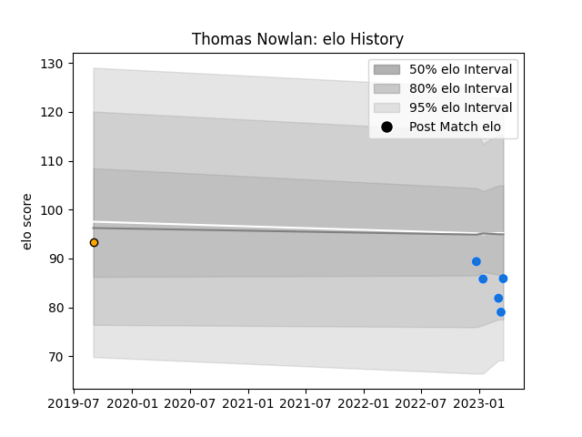

---  
layout: page  
title: Thomas Nowlan  
date: 2023-03-21 18:01:03.928267  
categories: player  
---
# Thomas Nowlan

Last updated: 2023-03-21
## Positions: L

## Current elo: 86.0

## Current Percentile: 12.0

# Elo History

# Match History

| Team                |   Appearances |   Win Rate |
|:--------------------|--------------:|-----------:|
| Shimizu Blue Sharks |             5 |        0.2 |
| NSW Country Eagles  |             1 |        1   |

| Opponent          |   Matches |   Win Rate |
|:------------------|----------:|-----------:|
| Kamaishi Seawaves |         2 |        0.5 |
| Urayasu D-Rocks   |         2 |        0   |
| Mie Honda Heat    |         1 |        0   |
| Sydney Rays       |         1 |        1   |