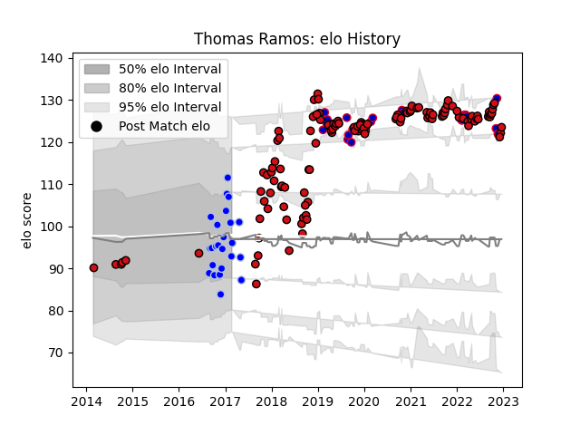

---  
layout: page  
title: Thomas Ramos  
date: 2023-02-03 10:25:33.314184  
categories: player  
---
# Thomas Ramos

## Positions: FB, FH

## Country: France

## Current elo: 93.0

## Current Percentile: 58.0

# Elo History

# Match History

| Team             |   Appearances |   Win Rate |
|:-----------------|--------------:|-----------:|
| Stade Toulousain |           123 |   0.756098 |
| Colomiers        |            24 |   0.645833 |
| France           |            21 |   0.809524 |

| Opponent                 |   Matches |   Win Rate |
|:-------------------------|----------:|-----------:|
| La Rochelle              |        11 |   0.909091 |
| Castres Olympique        |        11 |   0.363636 |
| Bordeaux Begles          |        10 |   1        |
| Clermont Auvergne        |        10 |   0.75     |
| Toulon                   |         8 |   0.6875   |
| Montpellier Herault      |         8 |   0.75     |
| Agen                     |         7 |   0.928571 |
| Brive                    |         7 |   1        |
| Pau                      |         6 |   0.5      |
| Racing 92                |         6 |   0.833333 |
| Stade Francais Paris     |         6 |   0.833333 |
| Lyon                     |         6 |   0.416667 |
| Perpignan                |         5 |   1        |
| Scotland                 |         5 |   0.6      |
| Biarritz Olympique       |         4 |   0.75     |
| Oyonnax                  |         4 |   0.875    |
| Ireland                  |         3 |   0.666667 |
| Leinster                 |         3 |   0.333333 |
| Wales                    |         3 |   1        |
| Italy                    |         3 |   1        |
| Wasps                    |         3 |   0.666667 |
| Bayonne                  |         3 |   0.666667 |
| Grenoble                 |         2 |   1        |
| Montauban                |         2 |   0        |
| Bath Rugby               |         2 |   1        |
| Gloucester Rugby         |         2 |   1        |
| Narbonne                 |         2 |   1        |
| Connacht                 |         2 |   1        |
| Bourgoin-Jallieu         |         2 |   0.5      |
| Mont-de-Marsan           |         2 |   0.5      |
| Dax                      |         2 |   0.5      |
| England                  |         2 |   0.5      |
| Albi                     |         2 |   0.5      |
| Soyaux-Angouleme         |         1 |   0        |
| Argentina                |         1 |   1        |
| Vannes                   |         1 |   1        |
| United States of America |         1 |   1        |
| Ulster                   |         1 |   1        |
| Australia                |         1 |   1        |
| South Africa             |         1 |   1        |
| Munster                  |         1 |   1        |
| Exeter Chiefs            |         1 |   0        |
| Sale Sharks              |         1 |   1        |
| Beziers                  |         1 |   1        |
| Carcassonne              |         1 |   1        |
| Cardiff Blues            |         1 |   0        |
| Japan                    |         1 |   1        |