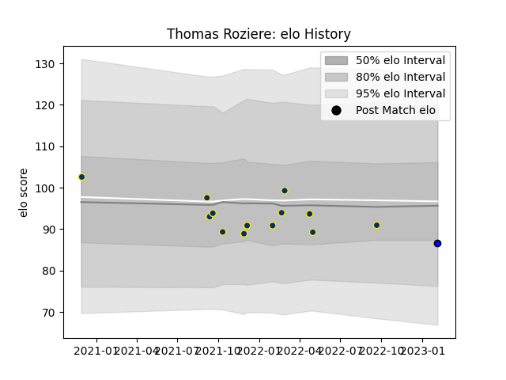

---  
layout: page  
title: Thomas Roziere  
date: 2023-02-04 17:23:54.316007  
categories: player  
---
# Thomas Roziere

## Positions: W, FB

## Current elo: 87.0

## Current Percentile: 43.0

# Elo History

# Match History

| Team              |   Appearances |   Win Rate |
|:------------------|--------------:|-----------:|
| Clermont Auvergne |            13 |   0.384615 |
| Massy             |             1 |   1        |

| Opponent             |   Matches |   Win Rate |
|:---------------------|----------:|-----------:|
| Castres Olympique    |         3 |   0.333333 |
| La Rochelle          |         2 |   0.5      |
| Perpignan            |         2 |   0.5      |
| Stade Francais Paris |         2 |   0.5      |
| Biarritz Olympique   |         1 |   1        |
| Carcassonne          |         1 |   1        |
| Lyon                 |         1 |   0        |
| Pau                  |         1 |   0        |
| Toulon               |         1 |   0        |