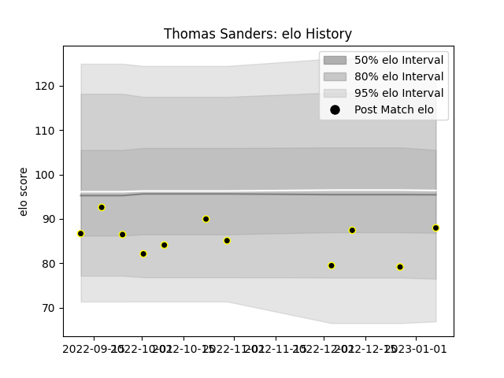

---  
layout: page  
title: Thomas Sanders  
date: 2023-01-13 11:39:23.093696  
categories: player  
---
# Thomas Sanders

## Positions: L

## Current elo: 88.0

## Current Percentile: 12.0

# Elo History

# Match History

| Team   |   Appearances |   Win Rate |
|:-------|--------------:|-----------:|
| Caldy  |            11 |   0.272727 |

| Opponent            |   Matches |   Win Rate |
|:--------------------|----------:|-----------:|
| Ampthill            |         1 |          0 |
| Bedford             |         1 |          0 |
| Cornish Pirates     |         1 |          1 |
| Coventry            |         1 |          0 |
| Doncaster           |         1 |          0 |
| Ealing Trailfinders |         1 |          1 |
| Hartpury College    |         1 |          0 |
| Jersey              |         1 |          0 |
| London Scottish     |         1 |          0 |
| Nottingham          |         1 |          0 |
| Richmond            |         1 |          1 |