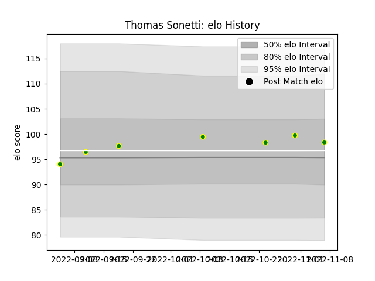

---  
layout: page  
title: Thomas Sonetti  
date: 2023-03-21 18:27:37.183563  
categories: player  
---
# Thomas Sonetti

Last updated: 2023-03-21
## Positions: SH

## Current elo: 120.0

## Current Percentile: 94.0

# Elo History

# Match History

| Team                |   Appearances |   Win Rate |
|:--------------------|--------------:|-----------:|
| Carqueiranne-Hyères |            16 |     0.4375 |

| Opponent                   |   Matches |   Win Rate |
|:---------------------------|----------:|-----------:|
| Chambery                   |         2 |        0.5 |
| Cognac Saint Jean d'Angély |         2 |        1   |
| Suresnes                   |         2 |        0.5 |
| Tarbes                     |         2 |        0.5 |
| Albi                       |         1 |        1   |
| Blagnac                    |         1 |        0   |
| Bourgoin-Jallieu           |         1 |        0   |
| Narbonne                   |         1 |        0   |
| Nice                       |         1 |        0   |
| Rennes                     |         1 |        0   |
| US Bressane                |         1 |        1   |
| Valence Romans Drome Rugby |         1 |        0   |