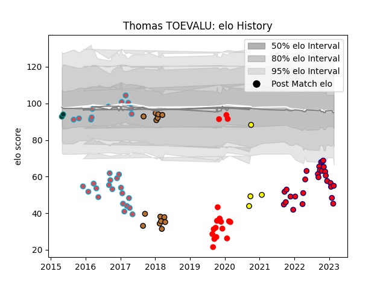

---  
layout: page  
title: Thomas TOEVALU  
date: 2023-03-29 11:30:03.005964  
categories: player  
---
# Thomas TOEVALU

Last updated: 2023-03-29
## Positions: N8, FL

## Current elo: 58.0

## Current Percentile: 2.0

# Elo History

# Match History

| Team                       |   Appearances |   Win Rate |
|:---------------------------|--------------:|-----------:|
| Cognac Saint Jean d'Angély |            31 |   0.129032 |
| Bourgoin-Jallieu           |            30 |   0.25     |
| Rouen                      |            17 |   0.294118 |
| Narbonne                   |            14 |   0.178571 |
| Albi                       |             4 |   0.375    |
| Pau                        |             2 |   0        |

| Opponent                   |   Matches |   Win Rate |
|:---------------------------|----------:|-----------:|
| Dax                        |         7 |   0.428571 |
| Mont-de-Marsan             |         6 |   0.166667 |
| Albi                       |         6 |   0.166667 |
| Aurillac                   |         6 |   0.166667 |
| Beziers                    |         6 |   0        |
| Colomiers                  |         5 |   0.2      |
| Narbonne                   |         5 |   0.2      |
| Perpignan                  |         4 |   0.25     |
| Nice                       |         4 |   0.375    |
| Chambery                   |         4 |   0.25     |
| Montauban                  |         4 |   0.25     |
| US Bressane                |         3 |   0        |
| Tarbes                     |         3 |   0.333333 |
| Soyaux-Angouleme           |         3 |   0        |
| Oyonnax                    |         3 |   0.333333 |
| Vannes                     |         3 |   0.166667 |
| Carcassonne                |         3 |   0.333333 |
| Blagnac                    |         3 |   0.333333 |
| Massy                      |         2 |   0        |
| Grenoble                   |         2 |   0.25     |
| Carqueiranne-Hyères        |         2 |   0        |
| Bourgoin-Jallieu           |         2 |   0        |
| Rennes                     |         2 |   0        |
| Roval Drome XV             |         2 |   1        |
| Valence Romans Drome Rugby |         2 |   0        |
| Agen                       |         2 |   0        |
| Nevers                     |         1 |   0        |
| Suresnes                   |         1 |   0        |
| Biarritz Olympique         |         1 |   0        |
| Bayonne                    |         1 |   1        |