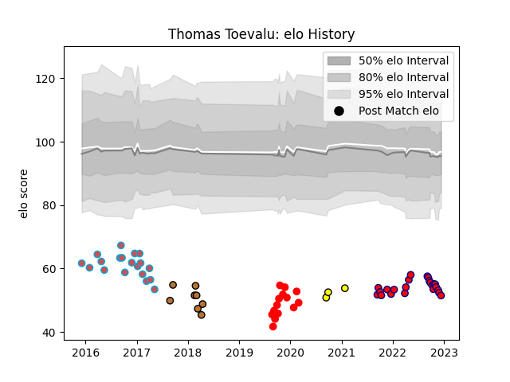

---  
layout: page  
title: Thomas Toevalu  
date: 2022-12-18 16:33:03.167342  
categories: player  
---
# Thomas Toevalu

## Positions: N8, FL

## Current elo: 51.0

## Current Percentile: 0.0

# Elo History

# Match History

| Team                       |   Appearances |   Win Rate |
|:---------------------------|--------------:|-----------:|
| Cognac Saint Jean d'Angély |            23 |   0.173913 |
| Bourgoin-Jallieu           |            19 |   0.131579 |
| Rouen                      |            14 |   0.285714 |
| Narbonne                   |             8 |   0.1875   |
| Albi                       |             3 |   0.166667 |

| Opponent                   |   Matches |   Win Rate |
|:---------------------------|----------:|-----------:|
| Aurillac                   |         5 |   0.2      |
| Beziers                    |         5 |   0        |
| Perpignan                  |         4 |   0.25     |
| Nice                       |         4 |   0.375    |
| Dax                        |         4 |   0.5      |
| Mont-de-Marsan             |         3 |   0        |
| Chambery                   |         3 |   0.333333 |
| Albi                       |         3 |   0        |
| Colomiers                  |         3 |   0        |
| Vannes                     |         3 |   0.166667 |
| Oyonnax                    |         2 |   0.5      |
| Bourgoin-Jallieu           |         2 |   0        |
| Grenoble                   |         2 |   0.25     |
| Massy                      |         2 |   0        |
| Blagnac                    |         2 |   0.5      |
| Montauban                  |         2 |   0        |
| Narbonne                   |         2 |   0        |
| Valence Romans Drome Rugby |         2 |   0        |
| US Bressane                |         2 |   0        |
| Soyaux-Angouleme           |         2 |   0        |
| Roval Drome XV             |         1 |   1        |
| Tarbes                     |         1 |   0        |
| Suresnes                   |         1 |   0        |
| Carqueiranne-Hyères        |         1 |   0        |
| Rennes                     |         1 |   0        |
| Bayonne                    |         1 |   1        |
| Carcassonne                |         1 |   1        |
| Biarritz Olympique         |         1 |   0        |
| Nevers                     |         1 |   0        |
| Agen                       |         1 |   0        |