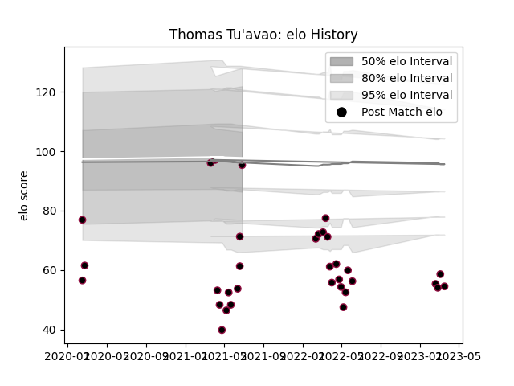

---  
layout: page  
title: Thomas Tu'avao  
date: 2023-03-21 18:09:17.120064  
categories: player  
---
# Thomas Tu'avao

Last updated: 2023-03-21
## Positions: FL, L

## Current elo: 95.0

## Current Percentile: 7.0

# Elo History

# Match History

| Team          |   Appearances |   Win Rate |
|:--------------|--------------:|-----------:|
| Utah Warriors |            33 |        0.5 |

| Opponent               |   Matches |   Win Rate |
|:-----------------------|----------:|-----------:|
| Houston SaberCats      |         4 |       0.5  |
| New England Free Jacks |         4 |       0.5  |
| San Diego Legion       |         4 |       0.25 |
| Dallas Jackals         |         3 |       1    |
| Seattle Seawolves      |         3 |       0    |
| Austin Gilgronis       |         2 |       0.5  |
| Austin Herd            |         2 |       0.75 |
| L. A. Giltinis         |         2 |       0.5  |
| NOLA Gold              |         2 |       0    |
| Old Glory DC           |         2 |       0.5  |
| Chicago Hounds         |         1 |       1    |
| R.U. New York          |         1 |       1    |
| Rugby ATL              |         1 |       1    |
| Rugby New York         |         1 |       1    |
| Toronto Arrows         |         1 |       0    |