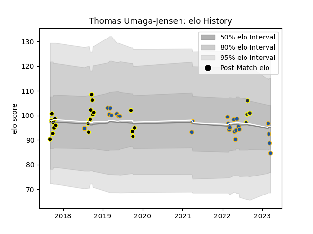

---  
layout: page  
title: Thomas Umaga-Jensen  
date: 2023-03-21 18:38:04.012617  
categories: player  
---
# Thomas Umaga-Jensen

Last updated: 2023-03-21
## Positions: C

## Current elo: 85.0

## Current Percentile: 29.0

# Elo History

# Match History

| Team        |   Appearances |   Win Rate |
|:------------|--------------:|-----------:|
| Highlanders |            25 |   0.34     |
| Wellington  |            21 |   0.809524 |
| Otago       |             5 |   0.4      |

| Opponent         |   Matches |   Win Rate |
|:-----------------|----------:|-----------:|
| Hurricanes       |         4 |   0        |
| Blues            |         4 |   0        |
| Otago            |         3 |   1        |
| Northland        |         3 |   1        |
| Canterbury       |         3 |   0.666667 |
| Chiefs           |         3 |   0.333333 |
| Melbourne Rebels |         3 |   0.333333 |
| Crusaders        |         3 |   0.333333 |
| Southland        |         3 |   1        |
| North Harbour    |         2 |   0.5      |
| Bay of Plenty    |         2 |   0.5      |
| Western Force    |         2 |   1        |
| Counties Manukau |         2 |   0.5      |
| Tasman           |         2 |   0.5      |
| Stormers         |         1 |   0        |
| Taranaki         |         1 |   1        |
| Waikato          |         1 |   1        |
| Wellington       |         1 |   0        |
| Auckland         |         1 |   0        |
| Queensland Reds  |         1 |   1        |
| Jaguares         |         1 |   1        |
| Hawke's Bay      |         1 |   1        |
| Fijian Drua      |         1 |   1        |
| Bulls            |         1 |   0.5      |
| Brumbies         |         1 |   0        |
| Manawatu         |         1 |   1        |