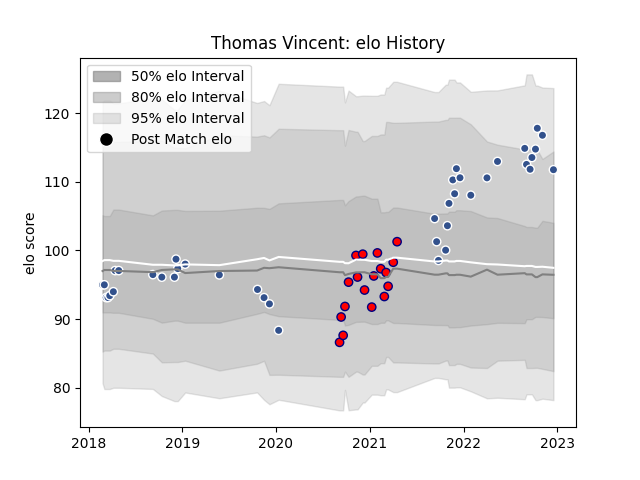

---  
layout: page  
title: Thomas Vincent  
date: 2023-02-02 18:39:28.688323  
categories: player  
---
# Thomas Vincent

## Positions: FH

## Current elo: 96.0

## Current Percentile: 88.0

# Elo History

# Match History

| Team     |   Appearances |   Win Rate |
|:---------|--------------:|-----------:|
| Agen     |            48 |   0.4375   |
| Aurillac |            23 |   0.413043 |

| Opponent                   |   Matches |   Win Rate |
|:---------------------------|----------:|-----------:|
| Grenoble                   |         5 |   0.4      |
| Vannes                     |         5 |   0.4      |
| Rouen                      |         5 |   0.6      |
| Carcassonne                |         4 |   0.5      |
| Colomiers                  |         4 |   0.25     |
| Oyonnax                    |         4 |   0.5      |
| Montauban                  |         4 |   0.5      |
| Beziers                    |         3 |   0.333333 |
| Biarritz Olympique         |         3 |   0.666667 |
| Provence Rugby             |         3 |   0.666667 |
| Soyaux-Angouleme           |         3 |   0.333333 |
| Mont-de-Marsan             |         3 |   0.333333 |
| Stade Francais Paris       |         2 |   1        |
| Pau                        |         2 |   0.5      |
| Nevers                     |         2 |   0.5      |
| Aurillac                   |         2 |   1        |
| Clermont Auvergne          |         2 |   0.5      |
| Bordeaux Begles            |         2 |   0        |
| Racing 92                  |         2 |   0        |
| Toulon                     |         1 |   0        |
| US Bressane                |         1 |   0        |
| Valence Romans Drome Rugby |         1 |   0        |
| Montpellier Herault        |         1 |   1        |
| Perpignan                  |         1 |   0.5      |
| Benetton Treviso           |         1 |   0        |
| Harlequins                 |         1 |   0        |
| Edinburgh                  |         1 |   0        |
| Castres Olympique          |         1 |   1        |
| Brive                      |         1 |   0        |
| Wasps                      |         1 |   0        |